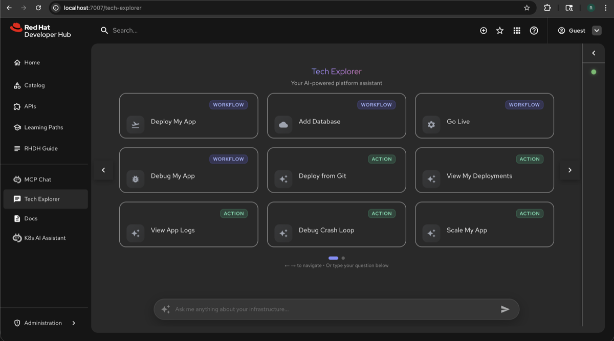
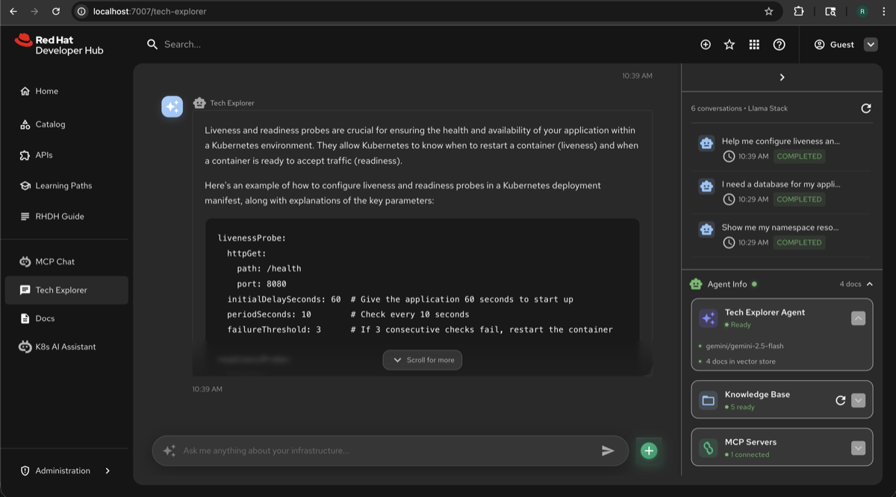

# Augment Plugin

A Backstage frontend plugin for **Augment** — a multi-agent AI assistant built on Llama Stack's OpenAI-compatible Responses API.

Augment adapts to YOUR documentation and tools. Configure agents, connect MCP servers, ingest knowledge bases, and get AI-powered answers — all from a single chat interface inside Backstage.

## Features

- **Multi-Agent Chat**: Conversations can span multiple specialized agents via handoffs, with the active agent displayed in the UI
- **RAG-Powered Search**: Ask questions and get accurate answers grounded in your documentation
- **Config-Driven Ingestion**: Documents are automatically synced from configured sources (directories, URLs, GitHub repos)
- **Agentic AI**: Powered by the Responses API — agents reason about questions, call tools, and synthesize answers
- **Rich Chat Interface**: Streaming responses with markdown, code blocks, and source citations
- **MCP Integration**: Connect to MCP servers for extended tool capabilities (e.g., Kubernetes, OpenShift)
- **Configurable Prompts**: Customize quick prompts for your specific use cases
- **Conversation History**: Persistent chat sessions backed by Llama Stack's Conversations API
- **3 Security Modes**: Flexible authentication from open access to full Keycloak integration

## Screenshots

### Welcome Screen

The welcome screen displays quick-action workflow cards and common tasks to help users get started quickly.



### Chat Interface

Ask questions and receive AI-powered responses with markdown formatting, code blocks, and helpful explanations.


### Right Pane with Conversation History

The collapsible right pane shows conversation history, agent status, knowledge base info, and connected MCP servers.



## Installation

### Static Plugin Installation (Standard Backstage)

#### Backend Installation

1. **Install the backend plugin**:

```bash
# From your Backstage root directory
yarn --cwd packages/backend add @red-hat-developer-hub/backstage-plugin-augment-backend
```

2. **Add to your backend**:

```ts
// In packages/backend/src/index.ts
const backend = createBackend();
// ... other plugins
backend.add(import('@red-hat-developer-hub/backstage-plugin-augment-backend'));
```

#### Frontend Installation

1. **Install the frontend plugin**:

```bash
# From your Backstage root directory
yarn --cwd packages/app add @red-hat-developer-hub/backstage-plugin-augment
```

2. **Add to your app**:

```tsx
// In packages/app/src/App.tsx
import { AugmentPage } from '@red-hat-developer-hub/backstage-plugin-augment';

// Add to your routes
<Route path="/augment" element={<AugmentPage />} />;
```

3. **Add navigation**:

```tsx
// In packages/app/src/components/Root/Root.tsx
import { AugmentIcon } from '@red-hat-developer-hub/backstage-plugin-augment';

// In your sidebar items
<SidebarItem icon={AugmentIcon} to="augment" text="Augment" />;
```

---

## Dynamic Plugin Deployment (Red Hat Developer Hub)

This section describes how to build, package, and deploy Augment as a dynamic plugin for Red Hat Developer Hub (RHDH).

### Prerequisites

- Node.js 22+ and Yarn installed
- Podman or Docker installed
- Access to a container registry (e.g., Quay.io, Docker Hub)
- `@red-hat-developer-hub/cli` package (installed via npx)

### Step 1: Install Dependencies

```bash
cd workspaces/augment
yarn install
```

### Step 2: Build the Plugins

```bash
# Build frontend plugin
cd plugins/augment
yarn build

# Build backend plugin
cd ../augment-backend
yarn build
```

### Step 3: Export as Dynamic Plugins

```bash
# Export frontend plugin
cd plugins/augment
npx @red-hat-developer-hub/cli@latest plugin export

# Export backend plugin
cd ../augment-backend
npx @red-hat-developer-hub/cli@latest plugin export
```

This creates `dist-dynamic/` directories in each plugin folder containing the dynamic plugin packages.

### Step 4: Package into OCI Image

```bash
# Create a temporary directory for packaging
rm -rf /tmp/augment-dynamic-plugins
mkdir -p /tmp/augment-dynamic-plugins

# Copy exported plugins
cp -r plugins/augment/dist-dynamic /tmp/augment-dynamic-plugins/rhdh-plugin-augment
cp -r plugins/augment-backend/dist-dynamic /tmp/augment-dynamic-plugins/rhdh-plugin-augment-backend

# Create metadata file
cat > /tmp/augment-dynamic-plugins/index.json << 'EOF'
[
  {
    "rhdh-plugin-augment": {
      "name": "@red-hat-developer-hub/backstage-plugin-augment-dynamic",
      "version": "0.1.0",
      "description": "Frontend plugin for Augment",
      "backstage": { "role": "frontend-plugin", "pluginId": "augment", "supported-versions": "1.42.0" },
      "license": "Apache-2.0"
    }
  },
  {
    "rhdh-plugin-augment-backend": {
      "name": "@red-hat-developer-hub/backstage-plugin-augment-backend-dynamic",
      "version": "0.1.0",
      "description": "Backend plugin for Augment",
      "backstage": { "role": "backend-plugin", "pluginId": "augment", "supported-versions": "1.42.0" },
      "license": "Apache-2.0"
    }
  }
]
EOF

# Build OCI image
cd /tmp/augment-dynamic-plugins
echo "FROM scratch
COPY . ." | podman build --platform linux/amd64 -t <your-registry>/<your-repo>:<tag> -f - .
```

Replace `<your-registry>/<your-repo>:<tag>` with your actual registry path, e.g., `quay.io/myorg/augment:v0.1.0`.

### Step 5: Push to Registry

```bash
# Login to your registry
podman login <your-registry> -u <username> -p <password>

# Push the image
podman push <your-registry>/<your-repo>:<tag>
```

### Step 6: Configure in RHDH

Add the following to your `dynamic-plugins.override.yaml`:

```yaml
plugins:
  # Frontend plugin
  - package: oci://<your-registry>/<your-repo>:<tag>!rhdh-plugin-augment
    disabled: false
    pluginConfig:
      dynamicPlugins:
        frontend:
          rhdh-plugin-augment:
            dynamicRoutes:
              - path: '/augment
                importName: AugmentPage
            menuItems:
              augment:
                title: Augment
                icon: chat

  # Backend plugin
  - package: oci://<your-registry>/<your-repo>:<tag>!rhdh-plugin-augment-backend
    disabled: false
```

### Step 7: Apply Changes in RHDH

```bash
# Reinstall plugins
podman compose run install-dynamic-plugins

# Restart RHDH
podman compose stop rhdh && podman compose start rhdh
```

---

## Configuration

Add the following to your `app-config.yaml`:

```yaml
augment:
  # Security mode (see docs/SECURITY_MODES.md for details)
  security:
    mode: 'plugin-only' # 'none' | 'plugin-only' | 'full'

  llamaStack:
    # Base URL for the Llama Stack server
    baseUrl: 'https://your-llama-stack-server.com'
    # ID of the vector store to use for RAG
    vectorStoreId: 'your-vector-store-id'
    # Model to use for chat completions
    model: 'meta-llama/Llama-3.2-3B-Instruct'
    # Optional: Chunking strategy for file uploads
    chunkingStrategy: 'static' # or 'auto'
    maxChunkSizeTokens: 200
    chunkOverlapTokens: 50
    # Optional: API token for authentication
    # token: ${LLAMA_STACK_TOKEN}

  # Document sources for automatic ingestion
  documents:
    # Sync mode: 'full' (add new + remove deleted) or 'append' (only add new)
    syncMode: full
    # Optional: How often to sync (e.g., '1h', '30m', '1d')
    syncSchedule: '1h'

    sources:
      # Local directory
      - type: directory
        path: ./docs/knowledge-base
        patterns:
          - '**/*.md'
          - '**/*.yaml'

      # URLs
      - type: url
        urls:
          - https://raw.githubusercontent.com/org/repo/main/docs/README.md

      # GitHub repository
      - type: github
        repo: 'your-org/documentation'
        branch: main
        path: docs/
        patterns:
          - '*.md'
        # token: ${GITHUB_TOKEN}  # For private repos

  # Optional: MCP servers for extended capabilities
  mcpServers:
    - id: kubernetes
      name: 'Kubernetes Tools'
      type: streamable-http
      url: 'http://localhost:8080/mcp'

  # Optional: Custom system prompt
  systemPrompt: 'You are a helpful documentation assistant...'

  # Optional: Quick prompts for common queries
  quickPrompts:
    - title: 'Search Documentation'
      description: 'Find relevant information'
      prompt: 'Search the documentation for...'
      category: Search
```

## How It Works

1. **Automatic Ingestion**: On startup, documents are fetched from configured sources and uploaded to Llama Stack's vector store via the Files API
2. **Chunking**: Documents are automatically chunked and indexed for semantic search
3. **Periodic Sync**: If `syncSchedule` is configured, documents are re-synced at the specified interval
4. **Multi-Agent Routing**: The backend's `ResponsesApiCoordinator` assembles each agent's `POST /v1/responses` call from YAML config — each agent gets its own `instructions`, `tools`, `model`, and `temperature`
5. **Handoffs**: When a router agent calls a `transfer_to_{specialist}` tool, the coordinator switches the active agent and continues the conversation loop with the specialist's config
6. **RAG Search**: Agents with `enableRAG: true` include the `file_search` tool, which queries the vector store for relevant document chunks
7. **Tool Execution**: MCP tools, custom functions, and built-in tools (web search, code interpreter) are executed by the coordinator between LLM turns
8. **Conversation Persistence**: Chat sessions are persisted via Llama Stack's Conversations API (`/v1/conversations`) and can be resumed later

## UI Components

| Component                | Description                                                               |
| ------------------------ | ------------------------------------------------------------------------- |
| **Chat Interface**       | Streaming AI responses with markdown, code blocks, and source citations   |
| **Welcome Screen**       | Quick action cards and workflow suggestions                               |
| **Conversation History** | Browse and resume previous chat sessions (backed by Conversations API)    |
| **Knowledge Base Panel** | Read-only view of indexed documents with sync status                      |
| **Agent Status Panel**   | Shows active agent, available handoff targets, and MCP server connections |
| **Right Pane**           | Collapsible sidebar with conversation history, agent info, and settings   |

## Prerequisites

- Backstage v1.35+ (new backend system)
- Llama Stack server with:
  - Responses API enabled (OpenAI-compatible `POST /v1/responses`)
  - Conversations API enabled (`POST /v1/conversations`)
  - Files API enabled for document upload
  - Vector store created for RAG
  - Safety API enabled (optional, for guardrails)
- For RHDH: Red Hat Developer Hub 1.3+ with dynamic plugin support

## API Endpoints

| Endpoint                         | Method | Description                                                                          |
| -------------------------------- | ------ | ------------------------------------------------------------------------------------ |
| `/api/augment/chat`              | POST   | Send chat messages — the backend routes through agents and streams responses via SSE |
| `/api/augment/documents`         | GET    | List indexed documents (read-only)                                                   |
| `/api/augment/conversations`     | GET    | List conversation history (proxied from Llama Stack Conversations API)               |
| `/api/augment/conversations/:id` | GET    | Get a specific conversation with full message history                                |
| `/api/augment/conversations/:id` | DELETE | Delete a conversation                                                                |
| `/api/augment/sync`              | POST   | Trigger manual document sync from configured sources                                 |
| `/api/augment/status`            | GET    | Get service status (provider, vector store, MCP server connections)                  |

## Exports

The frontend plugin exports the following:

```ts
// Main exports
export { augmentPlugin } from './plugin'; // The plugin instance
export { AugmentPage } from './plugin'; // Main page component
export { AugmentIcon } from './plugin'; // Icon component for navigation
export { augmentApiRef } from './api'; // API reference for dependency injection
export * from './types'; // TypeScript types
```

## Development

```bash
# Navigate to the workspace
cd workspaces/augment

# Install dependencies
yarn install

# Start the development server
yarn start

# Run tests
yarn test

# Run linting
yarn lint

# Build all plugins
yarn build:all
```

## Troubleshooting

### Common Issues

**Plugin not loading in RHDH:**

- Verify the OCI image is accessible from RHDH
- Check `dynamic-plugins.override.yaml` syntax
- Review RHDH logs: `podman compose logs rhdh`

**RAG not returning results:**

- Verify vector store ID in configuration
- Check that documents have been ingested
- Confirm Llama Stack server is accessible

**MCP tools not available:**

- Verify MCP server URL is correct
- Check MCP server is running and accessible
- Review backend logs for connection errors

**Conversation history not loading:**

- Check Llama Stack Responses API is accessible
- Verify no corrupted data in Llama Stack storage
- Review network requests for error responses

For detailed troubleshooting steps, see [TROUBLESHOOTING.md](../augment-common/docs/TROUBLESHOOTING.md).

For a full configuration reference (YAML requirements, admin UI scope, defaults, precedence rules), see [CONFIG_REFERENCE.md](../augment-common/docs/CONFIG_REFERENCE.md).

## License

Apache-2.0
