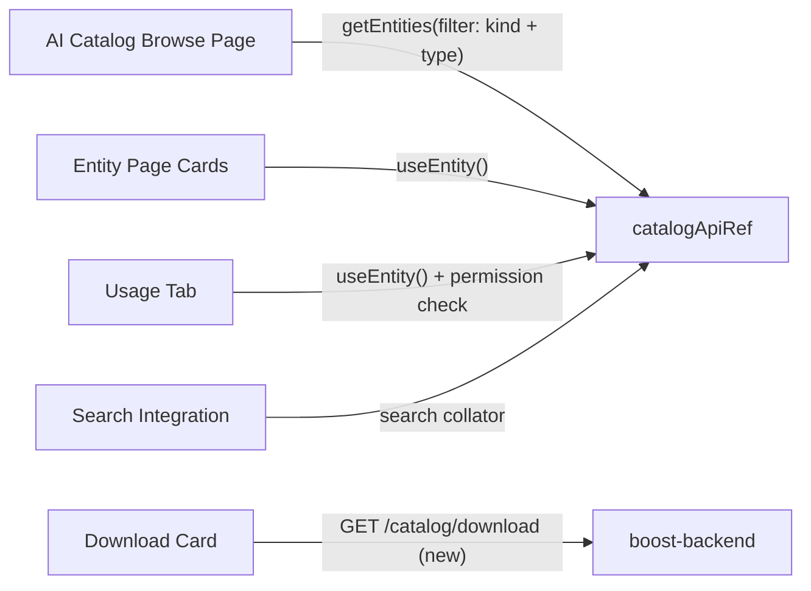
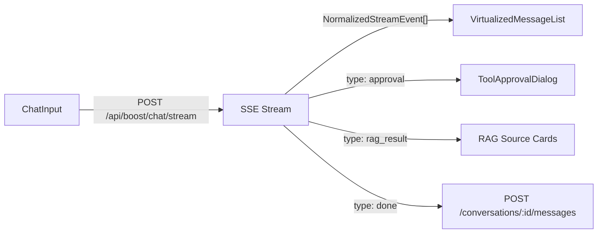

# Boost Frontend Architecture

## Overview

`plugins/boost` is the frontend plugin for the boost workspace in RHDH (`workspaces/boost/plugins/boost`). It is a multi-domain plugin that will grow to cover AI catalog discovery, agentic chat, agent lifecycle management, and platform administration. The AI Catalog ([RHDHPLAN-1509](https://redhat.atlassian.net/browse/RHDHPLAN-1509)) is the first feature delivered.

The plugin follows the NFS (New Frontend System) model with Blueprints, extending existing RHDH pages via `EntityCardBlueprint`, `EntityContentBlueprint`, etc., and adding new pages only where needed.

The boost backend already provides 30+ API routes across chat/streaming, conversations, agent lifecycle, MCP management, skills marketplace, and admin configuration. The frontend consumes these via `BoostApiClient` (for `/api/boost` routes) and the standard Backstage `catalogApiRef` (for catalog entity queries).

## Design Principles

### 1. Extend Existing Surfaces via NFS Blueprints

The plugin extends existing RHDH/Backstage pages wherever possible. Standalone pages are created only when no existing surface fits the interaction pattern.

| Surface Type         | Blueprint                       | When to use                                              |
| -------------------- | ------------------------------- | -------------------------------------------------------- |
| Standalone page      | `PageBlueprint`                 | Fundamentally new interaction (chat, marketplace browse) |
| Entity overview card | `EntityCardBlueprint`           | Summary widget on catalog entity pages                   |
| Entity tab           | `EntityContentBlueprint`        | Full content panel on entity pages                       |
| App drawer panel     | `AppDrawerContentBlueprint`     | Persistent side panel in RHDH shell                      |
| Global header action | `GlobalHeaderMenuItemBlueprint` | Quick-access button in header                            |
| Search result        | Search collator                 | Domain-specific results in global search                 |
| Scaffolder template  | Catalog entity                  | Workflow-driven creation (agent templates)               |

### 2. Consistent AI Experience via PatternFly AI Chatbot

RHDH already has **Lightspeed** as an AI chatbot feature, designed primarily for RAG. Boost adds agentic chat, tool calling, HITL approval, multi-agent handoffs, and streaming with phase indicators.

To maintain a consistent AI interaction experience across RHDH, boost uses the **PatternFly AI chatbot framework** (`@patternfly/chatbot`) for conversational UI. This keeps interaction patterns familiar to Lightspeed users while supporting boost's broader capabilities. Building on the same primitives keeps a future convergence path viable.

### 3. Components Decouple from Mount Points

UX designs for the full boost experience are evolving. The architecture separates component logic from mount points:

- Components are self-contained with their own data fetching and error handling
- Blueprints are thin wiring — remounting a component at a different surface is a configuration change
- The plugin structure supports adding new surfaces incrementally
- Components are refined to match finalized UX designs and wired into the appropriate Blueprints

### 4. Capability-Based Feature Gating

UI rendering decisions use `ProviderCapabilities` interface checks, never `providerId === 'string'` comparisons. This is a non-negotiable design principle inherited from the boost backend architecture.

Feature flags (`boost.features.*` in `app-config.yaml`) control visibility of entire domains. Disabled features are not rendered, not just hidden.

### 5. Permissions as Authorization

All authorization decisions use the Backstage permission framework (`usePermission` from `@backstage/plugin-permission-react`). A `SecurityGate` component wraps protected surfaces, checking `boost.access` at the top level.

### 6. Error Isolation

Each domain boundary has an error boundary so a failure in one surface (e.g., catalog unreachable) does not crash the RHDH shell or other boost surfaces. Errors are surfaced inline with retry affordances rather than full-page error screens.

---

## Plugin Structure

```
plugins/boost/
  src/
    index.ts                    # NFS entry point (createFrontendPlugin, all Blueprints, BUI CSS)
    plugin.ts                   # Plugin definition and route refs
    apis/
      BoostApiClient.ts         # Custom API client wrapping /api/boost routes (registered via ApiBlueprint)
    hooks/
      useAiAssets.ts            # Wraps catalogApiRef for AI asset queries
      useFeatureFlags.ts
      usePermissions.ts
    utils/
      isAiAsset.ts              # Entity condition filter for Blueprints
    components/
      catalog/                  # AI Catalog domain (RHDHPLAN-1509)
        AiCatalogPage.tsx       # Browse page
        AiAssetCard.tsx         # Card component
        AiAssetSummaryCard.tsx  # EntityCardBlueprint component
        DownloadAdoptCard.tsx   # EntityCardBlueprint component
        VersionListCard.tsx     # EntityCardBlueprint component
        UsageTab.tsx            # EntityContentBlueprint component
        filters/                # Search and filter components
      chat/                     # Chat domain (future)
      admin/                    # Admin domain (future)
    translations/               # i18n resources
```

---

## Backend API Surface

The frontend consumes APIs from `boost-backend` (mounted at `/api/boost`) and the standard Backstage `catalogApiRef`. All routes require user cookie auth except `/health`.

### Catalog Interaction (AI Catalog feature)

The AI Catalog browse page queries AI assets through the **standard Backstage catalog API**, not custom boost routes. Entity extensions also use catalog data.



**Key hook**: `useAiAssets(filters)` wraps `catalogApi.getEntities()` with filters matching the entity model:

- Kind + type combinations: `AiResource` (any type), `API` with `mcp-server`, `Component` with `ai-agent`, `Resource` with `ai-model`/`ai-tool`/`vector-store`
- Annotation filters on `rhdh.io/ai-asset-category`, `rhdh.io/ai-asset-source`
- Metadata filters on `spec.lifecycle`, `metadata.tags`, `spec.owner`

### Chat and Streaming (future)



**Stream event types** (`NormalizedStreamEvent` from `boost-common`): `text`, `reasoning`, `tool_call`, `tool_result`, `rag_result`, `handoff`, `approval`, `form`, `auth`, `artifact`, `citation`, `error`, `done`

**Rate limiting**: 60 req/min per user; `429` response with `Retry-After` header.

### Conversation History (future)

| Method   | Path                          | Purpose                                                       |
| -------- | ----------------------------- | ------------------------------------------------------------- |
| `GET`    | `/conversations`              | List sessions (with `?q=` search, `?allUsers=true` for admin) |
| `POST`   | `/conversations`              | Create session                                                |
| `GET`    | `/conversations/:id`          | Session + messages                                            |
| `DELETE` | `/conversations/:id`          | Delete session                                                |
| `POST`   | `/conversations/:id/messages` | Persist message                                               |
| `POST`   | `/conversations/:id/feedback` | Submit feedback                                               |
| `GET`    | `/conversations/:id/export`   | Export session JSON                                           |

### Agent Lifecycle (future)

| Method   | Path                            | Transition                       |
| -------- | ------------------------------- | -------------------------------- |
| `GET`    | `/agents`                       | List all agents                  |
| `PUT`    | `/agents/:id/register`          | Create governance record (draft) |
| `PUT`    | `/agents/:id/promote`           | draft -> pending                 |
| `PUT`    | `/agents/:id/approve`           | pending -> published             |
| `PUT`    | `/agents/:id/request-unpublish` | published -> archived            |
| `PUT`    | `/agents/:id/withdraw`          | pending -> draft                 |
| `DELETE` | `/agents/:id`                   | Delete (draft/archived only)     |

Lifecycle actions are permission-gated per agent ID. Self-approval is prevented (`IS_NOT_CREATOR` rule).

### MCP Server Management (future)

Full CRUD at `/mcp/servers` plus `POST /mcp/servers/:id/test` for connection testing. Uses `McpServerRecord` type with transport (`streamable-http`, `sse`) and auth type (`oauth-client-credentials`, `k8s-service-account`, `static-headers`, `infrastructure-mtls`, `none`).

### Skills Marketplace (future)

Feature-gated (`boost.features.skillsMarketplace`). Proxy routes to external skills catalog at `/skills`, `/skills/runtimes`, `/skills/domains`. Deploy via `POST /skills/deploy`.

### Admin Configuration (future)

Read-only `GET /config/status` currently. Frontend-visible config keys include `boost.model.baseUrl`, `boost.model.name`, `boost.features.agentCreation`, `boost.features.skillsMarketplace`. Write API for admin overrides is planned.

### Backend Gaps (stores exist, routes not yet wired)

| Area                      | Status                        | Impact on frontend                                                               |
| ------------------------- | ----------------------------- | -------------------------------------------------------------------------------- |
| HITL approval REST API    | `BackendApprovalStore` exists | Chat can receive `approval` stream events but cannot approve/reject via REST yet |
| Documents/RAG REST API    | `DocumentSyncService` exists  | RAG results come via chat stream; admin upload/sync UI waits for routes          |
| Admin config write API    | Read-only `/config/status`    | Admin panels can display config but not modify via UI yet                        |
| Provider listing endpoint | No `/providers` route         | Provider switcher needs this; can fall back to config-derived list               |

---

## Permissions

The frontend consumes 23 permissions from `boost-common`:

| Scope                | Permissions                                                                                                                        |
| -------------------- | ---------------------------------------------------------------------------------------------------------------------------------- |
| Top-level gates      | `boost.access`, `boost.admin`                                                                                                      |
| Chat                 | `boost.chat.read`, `boost.chat.create`                                                                                             |
| Agent lifecycle (10) | `boost.agent.list`, `.register`, `.configure`, `.promote`, `.approve`, `.demote`, `.publish`, `.unpublish`, `.withdraw`, `.delete` |
| Tool lifecycle (5)   | `boost.tool.promote`, `.approve`, `.demote`, `.publish`, `.unpublish`                                                              |
| Infrastructure       | `boost.kagenti.admin`                                                                                                              |
| Functional           | `boost.documents.manage`, `boost.mcp.manage`, `boost.config.manage`                                                                |

For AI Catalog specifically, RHDHPLAN-1508 defines two additional permissions: `ai-catalog.asset.read` and `ai-catalog.asset.read.usage-docs`. These are not yet in `boost-common` — they will be added as part of the RBAC feature (RHDHPLAN-1508).

---

## AI Asset Entity Model

Backstage v1.51.0 introduced two AI-related additions via `@backstage/plugin-catalog-backend-module-ai-model`:

- **`AiResource`** kind — for AI tools and governance rules. Built-in types: `skill` (with `disciplines`, `categories`, `agents`, `dependsOn`) and `rule` (with `category`, `rationale`). Any other `spec.type` string is accepted with the base spec (`type`, `lifecycle`, `owner`, `system`).
- **`API` with `spec.type: mcp-server`** — MCP servers as a structured subtype of the existing API kind, with `spec.remotes` list (RFC #32062).

Boost's entity model (Decision 1 in the agent-creation-discovery design) uses upstream kinds where available and existing kinds as fallback:

| Category      | Entity Kind  | `spec.type`    | Notes                                                                             |
| ------------- | ------------ | -------------- | --------------------------------------------------------------------------------- |
| Skills        | `AiResource` | `skill`        | Upstream. Has `disciplines`, `categories`, `agents`, `dependsOn`                  |
| Rules         | `AiResource` | `rule`         | Upstream. Has `category` (required), `rationale` (required)                       |
| MCP Servers   | `API`        | `mcp-server`   | Upstream. Has `spec.remotes` list                                                 |
| Agents        | `Component`  | `ai-agent`     | Boost-defined. No upstream kind yet                                               |
| Models        | `Resource`   | `ai-model`     | Boost-defined. RFC #33060 pending — may move to `API` with `ai-model-server` type |
| Tools         | `Resource`   | `ai-tool`      | Boost-defined (Kagenti-specific)                                                  |
| Vector Stores | `Resource`   | `vector-store` | Boost-defined                                                                     |

Boost-defined entities carry `rhdh.io/ai-asset-category`, `rhdh.io/ai-asset-version`, and `rhdh.io/ai-asset-source` annotations as an interim bridge (RHDHPLAN-1507). Custom `CatalogProcessor` validators support both current and future kinds during upstream transitions.

The `isAiAsset(entity)` condition filter checks entity kind and `spec.type` against this mapping. All entity page extensions use this filter.

---

## Future Domain Map

The AI Catalog is the first domain. Here is how future capabilities map to surfaces, backend APIs, and key components:

### Chat

- **Surfaces**: `PageBlueprint` + `AppDrawerContentBlueprint` for drawer access
- **Backend**: `POST /chat/stream` (SSE), conversation CRUD, feedback
- **Key components**: `ChatContainer`, `ChatInput`, `VirtualizedMessageList`, `StreamingMessage`, `ToolApprovalDialog`, `ConversationHistory`
- **PatternFly AI**: Uses `@patternfly/chatbot` for message rendering, input, streaming
- **Provider adaptation**: Llama Stack (auto-route to default agent) vs Kagenti (mandatory agent selection) — driven by `ProviderCapabilities`

### Agent Gallery and Lifecycle

- **Surfaces**: `EntityCardBlueprint` ("Start Conversation" on agent entities), `EntityContentBlueprint` ("Governance" tab with lifecycle actions), optional `PageBlueprint` for full gallery
- **Backend**: `GET /agents`, lifecycle `PUT` routes, catalog API for entity data
- **Key components**: Agent cards, lifecycle action buttons (promote/approve/withdraw), Review Queue
- **Governance**: 4-stage lifecycle (Draft -> Pending -> Published -> Archived) with ownership and self-approval prevention

### Admin Panels

- **Surfaces**: `PageBlueprint` with lazy-loaded panel groups
- **Backend**: `/config/status`, `/mcp/servers` CRUD, `/kagenti/status`, future config write API
- **Key components**: `AdminLayout` with capability-gated sidebar, config forms, MCP server editor, RAG pipeline manager, branding/appearance panels
- **Provider adaptation**: Kagenti shows 8-panel sidebar (agents, tools, build pipelines, sandbox, platform links); Llama Stack shows Command Center (agents, orchestration, model config)

### MCP Tool Configuration

- **Surfaces**: `EntityContentBlueprint` on MCP server entities + admin panel section
- **Backend**: `/mcp/servers` CRUD, `/mcp/servers/:id/test`, tool lifecycle routes
- **Key components**: MCP server list/editor, auth config forms (4 auth types), tool discovery, approval policy per tool

### Skills Marketplace

- **Surfaces**: Admin panel section (feature-gated)
- **Backend**: `/skills` proxy, `/skills/deploy`, `/skills/deployments/:id` poll
- **Key components**: Skills browse/filter, deploy wizard, deployment status

---

## Technology Stack

| Layer             | Technology                                                                                                   |
| ----------------- | ------------------------------------------------------------------------------------------------------------ |
| Component library | BUI (`@backstage/ui`) for new components, MUI v5 fallback where BUI lacks coverage, `@remixicon/react` icons |
| Chat UI           | `@patternfly/chatbot` for conversational interfaces                                                          |
| Styling           | CSS Modules with `--bui-*` CSS variables                                                                     |
| Frontend system   | NFS Blueprints (`createFrontendPlugin`, `PageBlueprint`, `EntityCardBlueprint`, etc.)                        |
| State             | React hooks + URL params for filters; streaming reducer for chat events                                      |
| API               | `catalogApiRef` for entity queries; `BoostApiClient` for `/api/boost` routes; `fetchApi` for auth            |
| Testing           | `TestApiProvider` + `renderInTestApp` from `@backstage/test-utils`                                           |
| i18n              | `TranslationBlueprint` + `useTranslationRef` (English-only initially)                                        |
| Dynamic plugins   | Scalprum federation, `dist-scalprum` build                                                                   |
| Accessibility     | WCAG 2.1 AA, keyboard navigation, screen reader support                                                      |

---

## Dev Preview Decisions

- **Standalone browse page**: The AI Catalog browse page is a dedicated `PageBlueprint`, not a filtered view of the existing catalog — the card grid with category grouping and inline actions is a different interaction pattern from the catalog table
- **Single entity filter**: One `isAiAsset(entity)` filter for all Blueprints; components handle kind-specific differences internally
- **Sample fixtures as contract**: Dev app uses `catalog-info.yaml` fixtures for all asset types — no dependency on backend entity providers being running
- **Client-side pagination**: `getEntities` returns full dataset; client-side page slicing is sufficient for the 500-asset target at Dev Preview
- **Default catalog search**: AI assets appear in RHDH global search via default catalog indexing; custom search collator with category labels is deferred
- **RBAC graceful degradation**: Permission checks for `ai-catalog.asset.read.usage-docs` default to allow when the permission isn't registered (RHDHPLAN-1508 not yet built); content is shown, and enforcement activates automatically when RBAC lands
