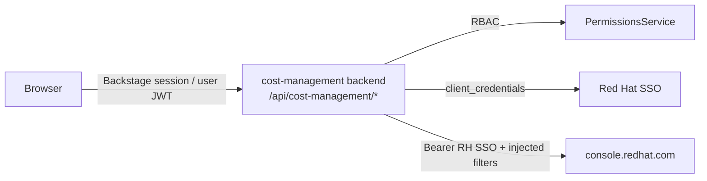
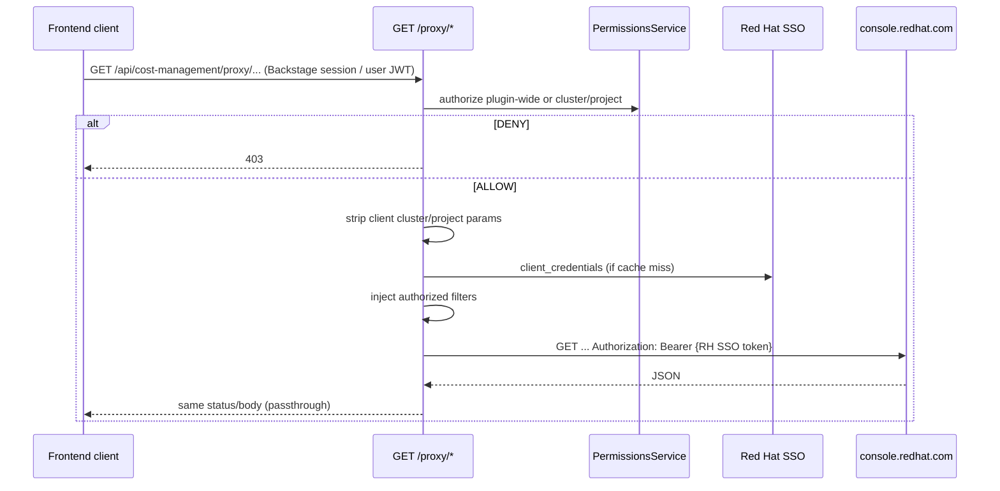

# Cost Management Plugin — API Flow

How data moves from the browser to `console.redhat.com` and back, with links to the code. For the big picture see [`architecture.md`](./architecture.md); for a walkthrough see [`walkthrough-architecture-api.md`](./walkthrough-architecture-api.md); for permissions see [`rbac.md`](./rbac.md).

## Contents

1. [Mental Model](#1-mental-model)
2. [Endpoints](#2-endpoints)
3. [Reading Data](#3-reading-data)
4. [SSO Token](#4-sso-token)
5. [Applying a Recommendation](#5-applying-a-recommendation)
6. [Auth at Each Hop](#6-auth-at-each-hop)
7. [Configuration](#7-configuration)
8. [Errors & Debugging](#8-errors--debugging)
9. [Related Documentation](#9-related-documentation)

---

## 1. Mental Model

Every data request is `Browser → cost-management backend → console.redhat.com`.

- Browser authenticates to the **Backstage backend** (session cookie and/or Backstage user JWT via `fetchApi`).
- Backend authenticates to **Red Hat** with a service-account SSO token it obtains via `client_credentials`.
- The RH SSO token and `clientId`/`clientSecret` never reach the frontend.

| Token in DevTools?        | Token                        | Hop                                  |
| ------------------------- | ---------------------------- | ------------------------------------ |
| Often **yes**             | Backstage user JWT           | Browser → `/api/cost-management/...` |
| **No** (server-side only) | RH SSO service-account token | Backend → `console.redhat.com`       |

Primary code:

- [`secureProxy.ts`](../plugins/cost-management-backend/src/routes/secureProxy.ts)
- [`tokenUtil.ts`](../plugins/cost-management-backend/src/util/tokenUtil.ts)
- [`checkPermissions.ts`](../plugins/cost-management-backend/src/util/checkPermissions.ts)
- Clients in [`plugins/cost-management-common/src/clients`](../plugins/cost-management-common/src/clients)

---

## 2. Endpoints

Mounted under `/api/cost-management`:

- Routes: [`router.ts`](../plugins/cost-management-backend/src/service/router.ts)
- Auth policies: [`plugin.ts`](../plugins/cost-management-backend/src/plugin.ts) (`user-cookie` on `/proxy`, `/access*`, `/apply-recommendation`)

| Method | Path                      | Auth          | Permission          | Used by UI? | Purpose                                                       |
| ------ | ------------------------- | ------------- | ------------------- | ----------- | ------------------------------------------------------------- |
| `GET`  | `/health`                 | none          | —                   | No          | Liveness                                                      |
| `GET`  | `/access`                 | `user-cookie` | `ros.*`             | No          | Optimizations access check (tooling)                          |
| `GET`  | `/access/cost-management` | `user-cookie` | `cost.*`            | No          | OpenShift cost access check (tooling)                         |
| `GET`  | `/proxy/*`                | `user-cookie` | `ros.*` or `cost.*` | **Yes**     | Secure proxy to Cost Mgmt / ROS-OCP                           |
| `POST` | `/apply-recommendation`   | `user-cookie` | `ros.apply`         | Yes         | Apply recommendation — see [§5](#5-applying-a-recommendation) |

`/proxy/*` appends the path after `/proxy/` to `{costManagementProxyBaseUrl}/cost-management/v1/`. **GET only.** Common paths:

| After `/proxy/`                      | Used for                          | Client                                                                                                                  |
| ------------------------------------ | --------------------------------- | ----------------------------------------------------------------------------------------------------------------------- |
| `recommendations/openshift`          | Optimizations list                | [`OptimizationsClient`](../plugins/cost-management-common/src/clients/optimizations/OptimizationsClient.ts)             |
| `recommendations/openshift/{id}`     | Optimizations breakdown           | same                                                                                                                    |
| `reports/openshift/costs/`           | OpenShift cost table/chart/export | [`CostManagementSlimClient`](../plugins/cost-management-common/src/clients/cost-management/CostManagementSlimClient.ts) |
| `resource-types/openshift-clusters/` | Cluster filter                    | same                                                                                                                    |
| `resource-types/openshift-projects/` | Project filter                    | same                                                                                                                    |
| `resource-types/openshift-nodes/`    | Node filter                       | same                                                                                                                    |
| `tags/openshift/`                    | Tag filters                       | same                                                                                                                    |

---

## 3. Reading Data

1. **UI** — [`OptimizationsPage.tsx`](../plugins/cost-management/src/pages/optimizations/OptimizationsPage.tsx) calls `optimizationsApiRef.getRecommendationList()`. Factories in [`plugin.ts`](../plugins/cost-management/src/plugin.ts) inject `discoveryApi` + `fetchApi`.
2. **Client / DiscoveryApi** — [`DiscoveryApi`](https://backstage.io/docs/reference/core-plugin-api.discoveryapi/) returns the backend base URL for a `pluginId` at runtime (no hardcoded hosts). [`OptimizationsClient.ts`](../plugins/cost-management-common/src/clients/optimizations/OptimizationsClient.ts) uses `getBaseUrl('cost-management')` + `/proxy` → e.g. `GET /api/cost-management/proxy/recommendations/openshift?...`. No RH SSO token in the browser. Backend Apply uses `DiscoveryService.getBaseUrl('orchestrator')` the same way.
3. **RBAC** — [`secureProxy.ts`](../plugins/cost-management-backend/src/routes/secureProxy.ts) → `resolveAccess()` / [`checkPermissions.ts`](../plugins/cost-management-backend/src/util/checkPermissions.ts). Plugin-wide first, else per-cluster/project (cached ~15 min). Deny → `403` + audit log ([`auditLog.ts`](../plugins/cost-management-backend/src/util/auditLog.ts)).
4. **SSO** — see [§4](#4-sso-token).
5. **Filters** — server replaces any client `cluster` / `project` / `filter[exact:…]` via `injectRbacFilters` in [`secureProxy.ts`](../plugins/cost-management-backend/src/routes/secureProxy.ts).
6. **Upstream** — backend `fetch` to `console.redhat.com` with `Authorization: Bearer <RH SSO token>`; response status/body passed through. Clients map `snake_case` ↔ `camelCase` where needed.

---

## 4. SSO Token

[`tokenUtil.ts`](../plugins/cost-management-backend/src/util/tokenUtil.ts) — `getTokenFromApi`:

- Cache key: `sso_access_token` (Backstage cache service).
- On miss/expiry: `POST` to Red Hat SSO with `grant_type=client_credentials`, `scope=api.console`, and `costManagement.clientId` / `clientSecret`.
- Token stays in the backend — never returned to the browser.
- Failure → HTTP `502` from the secure proxy.

Look for log lines `Using cached access token` / `Requesting new access token` when tracing SSO.

---

## 5. Applying a Recommendation

`POST /api/cost-management/apply-recommendation` ([`applyRecommendation.ts`](../plugins/cost-management-backend/src/routes/applyRecommendation.ts)) is the only write path. Frontend `usePermission` on the Apply button ([`OptimizationEngineTab.tsx`](../plugins/cost-management/src/pages/optimizations-breakdown/components/optimization-engine-tab/OptimizationEngineTab.tsx)) is UX only; the backend re-checks `ros.apply`, validates the body (resourceType allowlist + required fields), and audit-logs the attempt.

For Orchestrator design and demo, see [`architecture.md` §6](./architecture.md#6-applying-a-recommendation).

---

## 6. Auth at Each Hop

| Hop                          | Mechanism                                                | Code                                                                                     |
| ---------------------------- | -------------------------------------------------------- | ---------------------------------------------------------------------------------------- |
| Browser → backend            | Backstage session / user JWT (`user-cookie` policy)      | [`plugin.ts`](../plugins/cost-management-backend/src/plugin.ts)                          |
| Backend → PermissionsService | `httpAuth.credentials` + `permissions.authorize`         | [`checkPermissions.ts`](../plugins/cost-management-backend/src/util/checkPermissions.ts) |
| Backend → Red Hat SSO        | OAuth2 `client_credentials`                              | [`tokenUtil.ts`](../plugins/cost-management-backend/src/util/tokenUtil.ts)               |
| Backend → RHCC APIs          | `Authorization: Bearer` **RH SSO** service-account token | [`secureProxy.ts`](../plugins/cost-management-backend/src/routes/secureProxy.ts)         |

---

## 7. Configuration

| Key                                     | Required        | Default                          | Role                                     |
| --------------------------------------- | --------------- | -------------------------------- | ---------------------------------------- |
| `costManagement.clientId`               | Yes             | —                                | SSO client ID                            |
| `costManagement.clientSecret`           | Yes             | —                                | SSO client secret                        |
| `costManagement.ssoBaseUrl`             | No              | `https://sso.redhat.com`         | SSO host override                        |
| `costManagementProxyBaseUrl`            | No              | `https://console.redhat.com/api` | Proxy upstream base                      |
| `optimizationsBaseUrl`                  | No              | same as above                    | Backend direct Optimizations client base |
| `costManagement.optimizationWorkflowId` | Yes (for Apply) | —                                | Workflow ID for Apply                    |

Schemas: [`cost-management-backend/config.d.ts`](../plugins/cost-management-backend/config.d.ts) · [`cost-management/config.d.ts`](../plugins/cost-management/config.d.ts).

Upstream calls use this plugin’s secure proxy at `/api/cost-management/proxy/*`.

---

## 8. Errors & Debugging

| Status      | Meaning                                       |
| ----------- | --------------------------------------------- |
| `400`       | Bad path / invalid Apply body                 |
| `403`       | RBAC deny                                     |
| `502`       | SSO auth failed (`clientId`/`clientSecret`)   |
| `500`       | Unexpected / upstream failure                 |
| passthrough | Upstream status/body after RBAC + SSO succeed |

### Audit logs

[`auditLog.ts`](../plugins/cost-management-backend/src/util/auditLog.ts) uses Backstage’s [Logger Service](https://backstage.io/docs/backend-system/core-services/logger/) (`logger.info` with a JSON payload tagged `"audit": true`).

Fields: `actor`, `action` (`data_access` / `access_check` / `apply_recommendation`), `decision`, `resource`, optional `filters` / `meta`. See also [`plugins/cost-management-backend/README.md`](../plugins/cost-management-backend/README.md).

**Where to view them** (backend stdout only — no UI): with `yarn start` / `yarn start-backend`, grep the backend terminal for `"audit":true`.

`logger.error` lines (e.g. secure-proxy catch block) are operational errors, not audit entries.

**Quick check:**

1. DevTools → Network → filter `cost-management` → open `…/proxy/recommendations/openshift…`.
2. Host must be the Backstage backend, not `console.redhat.com`.
3. An `Authorization: Bearer …` header (if present) is the **Backstage user JWT** — decode it to confirm; it is **not** the RH SSO service-account token.
4. Matching `"audit":true` lines in backend logs for the same request.

Full checklist: [`walkthrough-architecture-api.md` §6](./walkthrough-architecture-api.md#6-hands-on-verification).

---

## 9. Related Documentation

- [`architecture.md`](./architecture.md) — packages, security model, config overview
- [`walkthrough-architecture-api.md`](./walkthrough-architecture-api.md) — walkthrough + verification checklist
- [`rbac.md`](./rbac.md) — permission names and policies
- [`local-dev-setup.md`](./local-dev-setup.md) · [`dynamic-plugin.md`](./dynamic-plugin.md)
- [`plugins/cost-management-backend/README.md`](../plugins/cost-management-backend/README.md)
- [Backstage Logger Service](https://backstage.io/docs/backend-system/core-services/logger/)
- [Backstage Auditor Service](https://backstage.io/docs/backend-system/core-services/auditor/) — related; not used by this plugin
