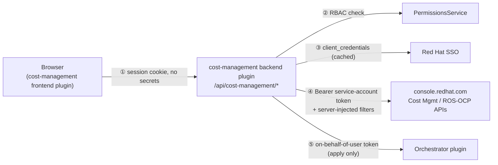
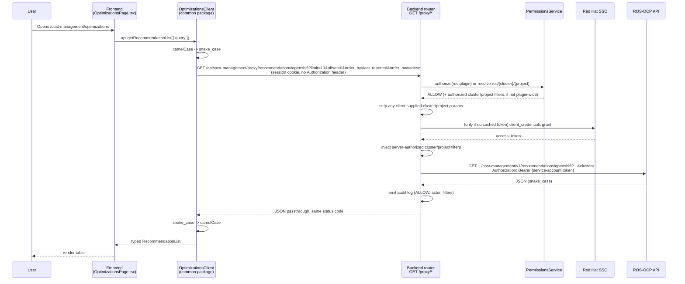
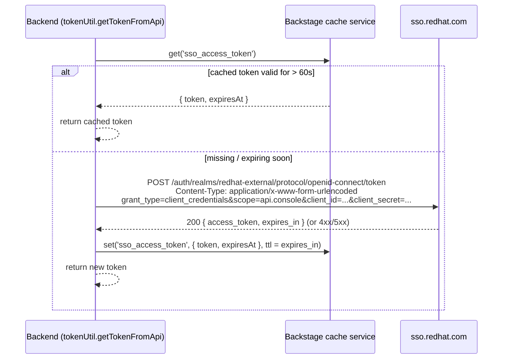
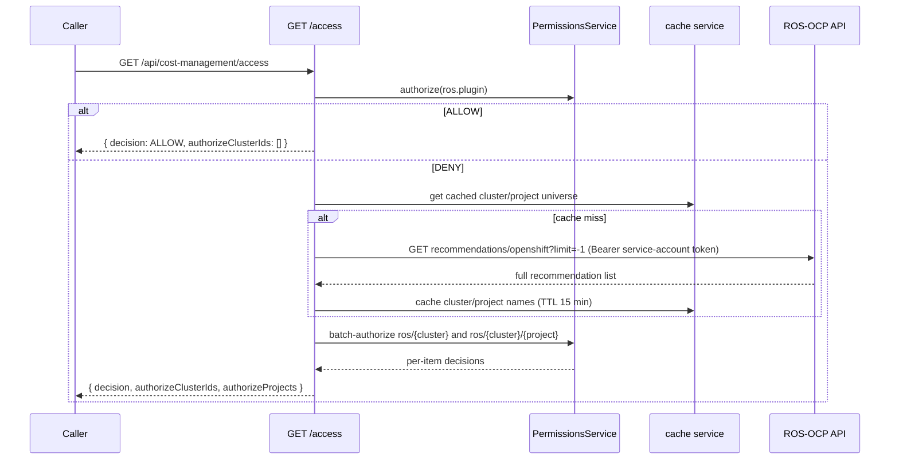
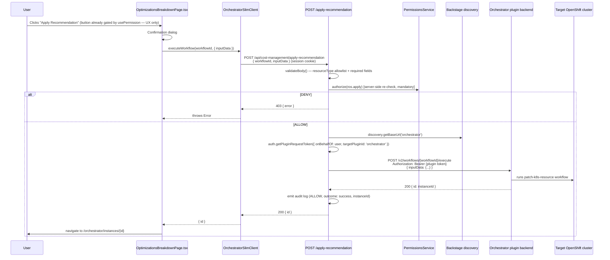

# Cost Management Plugin — API Flow

> **Audience:** anyone who needs to understand, debug, or give/receive a KT on how data moves through this plugin — from a click in the browser to the response rendered on screen. This document is a **code-level, hop-by-hop walkthrough of every API call** the plugin makes. For the broader architectural picture (package responsibilities, security rationale, deployment models, glossary) see [`docs/architecture.md`](./architecture.md); for the full permission/policy catalogue see [`docs/rbac.md`](./rbac.md). This doc intentionally overlaps a little with both, so it can be read standalone during a KT session.

## Table of Contents

- [1. Prerequisites](#1-prerequisites)
- [2. The One-Sentence Mental Model](#2-the-one-sentence-mental-model)
- [3. Actors & Components](#3-actors--components)
- [4. Endpoint Reference](#4-endpoint-reference)
- [5. Flow A — Reading data (secure proxy)](#5-flow-a--reading-data-secure-proxy)
- [6. Flow B — SSO service-account token acquisition](#6-flow-b--sso-service-account-token-acquisition)
- [7. Flow C — Access-check endpoints](#7-flow-c--access-check-endpoints)
- [8. Flow D — Applying a recommendation (write path)](#8-flow-d--applying-a-recommendation-write-path)
- [9. Authentication & Authorization at Each Hop](#9-authentication--authorization-at-each-hop)
- [10. Configuration Reference](#10-configuration-reference)
- [11. Request/Response Data Shapes](#11-requestresponse-data-shapes)
- [12. Error Handling & Status Codes](#12-error-handling--status-codes)
- [13. How to Trace a Request Yourself](#13-how-to-trace-a-request-yourself)
- [14. FAQ](#14-faq)
- [15. Related Documentation](#15-related-documentation)

---

## 1. Prerequisites

Before this document is useful to you, you should be comfortable with:

### Conceptual prerequisites

- **[Backstage](https://backstage.io/docs/overview/what-is-backstage)** fundamentals: frontend plugins vs. backend plugins, the [new backend system](https://backstage.io/docs/backend-system/) (`createBackendPlugin`, service refs, `coreServices`), the [`DiscoveryApi`](https://backstage.io/docs/reference/core-plugin-api.discoveryapi/) (how one plugin finds another plugin's base URL at runtime instead of hardcoding it), and the [Permission framework](https://backstage.io/docs/permissions/overview/) (`PermissionsService`, `AuthorizeResult`, `httpAuth.credentials`).
- **HTTP fundamentals** — methods, status codes, headers (`Authorization: Bearer …`, `Content-Type`), query strings.
- **OAuth2 Client Credentials Grant** — how a backend service authenticates to another service _as itself_ (a service account), not as a delegated user. This is exactly what the backend does against Red Hat SSO — see [§6](#6-flow-b--sso-service-account-token-acquisition).
- **Basic REST proxy concepts** — what it means for a backend to sit between a browser and a third-party API, and why you'd want that (hiding secrets, enforcing authorization, rewriting requests).
- A skim of **[`docs/architecture.md`](./architecture.md)** helps but isn't required — it covers _why_ the plugin is built this way; this doc covers _exactly what happens_ on the wire.
- A skim of **[`docs/rbac.md`](./rbac.md)** if you want the full permission-name catalogue; this doc only covers enough RBAC to explain the request flow.

### Environment / access prerequisites (only needed if you want to run requests yourself, not just read this doc)

- The repo checked out and running locally — see [`docs/local-dev-setup.md`](./local-dev-setup.md) (`yarn install`, `yarn start`, Node 22/24, Yarn 4.17.1).
- A Red Hat **service account** (Client ID + Secret) with the `Cost OpenShift Viewer` role — created at [console.redhat.com/iam/service-accounts](https://console.redhat.com/iam/service-accounts/) — configured as `costManagement.clientId` / `costManagement.clientSecret` in `app-config.local.yaml`. Without this, every proxied call in [§5](#5-flow-a--reading-data-secure-proxy) fails at the SSO step with a `502`.
- At least one OpenShift cluster already onboarded to Red Hat Hybrid Cloud Console (cost/optimization data flowing in) if you want to see non-empty responses. The plugin has nothing to show for clusters that haven't opted in.
- Browser DevTools (Network tab) and access to the backend process logs — both are used throughout [§13](#13-how-to-trace-a-request-yourself).
- (Optional) The RBAC plugin/policy file enabled, if you want to exercise the authorization branches instead of the "permission framework disabled → allow everything" default. See `policy.local.csv` and [`docs/rbac.md`](./rbac.md).
- (Optional, only for [§8](#8-flow-d--applying-a-recommendation-write-path)) An Orchestrator plugin instance with the `patch-k8s-resource` workflow deployed, and `costManagement.optimizationWorkflowId` configured.

---

## 2. The One-Sentence Mental Model

**The browser never talks to Red Hat's cloud APIs directly or holds any credential for them — every single data request goes `Browser → cost-management backend plugin → console.redhat.com`, authenticated to the backend by a normal Backstage session cookie and authenticated onward to Red Hat by a service-account token the backend manages entirely on its own.**



Everything below is this diagram, expanded step by step with real file references, real URLs, and real payloads.

---

## 3. Actors & Components

| Component               | Package                                                 | Where the code lives                                                   | Role in the API flow                                                                                                                                                                                                                                                  |
| ----------------------- | ------------------------------------------------------- | ---------------------------------------------------------------------- | --------------------------------------------------------------------------------------------------------------------------------------------------------------------------------------------------------------------------------------------------------------------- |
| **Frontend plugin**     | `@red-hat-developer-hub/plugin-cost-management`         | `plugins/cost-management/src`                                          | Renders pages, calls typed clients from the common package, never calls `fetch` directly and never talks to `console.redhat.com`                                                                                                                                      |
| **Backend plugin**      | `@red-hat-developer-hub/plugin-cost-management-backend` | `plugins/cost-management-backend/src`                                  | Express router mounted at `/api/cost-management/*`; authenticates the caller, authorizes via RBAC, obtains/caches the SSO token, rewrites and forwards requests, audit-logs everything                                                                                |
| **Common package**      | `@red-hat-developer-hub/plugin-cost-management-common`  | `plugins/cost-management-common/src`                                   | Shared API client classes (`OptimizationsClient`, `CostManagementSlimClient`, `OrchestratorSlimClient`), shared permission constants, generated + hand-written response types — used by **both** frontend and backend so the request/response shape is always in sync |
| **Red Hat SSO**         | External                                                | `sso.redhat.com`                                                       | Issues the service-account access token via OAuth2 client-credentials grant                                                                                                                                                                                           |
| **Cost Management API** | External                                                | `console.redhat.com/api/cost-management/v1/*`                          | Source of truth for OpenShift cost reports, cluster/project/node search, tags                                                                                                                                                                                         |
| **ROS-OCP API**         | External                                                | `console.redhat.com/api/cost-management/v1/recommendations/openshift*` | Source of truth for optimization recommendations                                                                                                                                                                                                                      |
| **Orchestrator plugin** | External RHDH plugin                                    | Resolved via Backstage `discovery`                                     | Executes the `patch-k8s-resource` workflow when a user applies a recommendation                                                                                                                                                                                       |
| **PermissionsService**  | Backstage core service                                  | RBAC community plugin (prod) / Casbin CSV (dev)                        | Makes the ALLOW/DENY decision for every permission the backend asks about                                                                                                                                                                                             |

---

## 4. Endpoint Reference

The backend plugin registers its router at Backstage plugin ID `cost-management`, so every path below is mounted under `/api/cost-management` (e.g. `GET /api/cost-management/health`). Routes are wired in `plugins/cost-management-backend/src/service/router.ts:171-183`; auth policies (`httpRouter.addAuthPolicy`) are declared alongside plugin registration in `plugins/cost-management-backend/src/plugin.ts:74-93`.

| Method | Path                      | Auth policy       | Permission-gated                          | Called by the frontend today?            | Purpose                                                                                                                                                 |
| ------ | ------------------------- | ----------------- | ----------------------------------------- | ---------------------------------------- | ------------------------------------------------------------------------------------------------------------------------------------------------------- |
| `GET`  | `/health`                 | `unauthenticated` | No                                        | No (liveness probe only)                 | Simple `{ status: 'ok' }` health check                                                                                                                  |
| `GET`  | `/access`                 | `user-cookie`     | Yes (`ros.*`)                             | No                                       | Returns the caller's Optimizations access decision + authorized cluster IDs/projects. Exists for RBAC tooling/testing, not wired into any UI page today |
| `GET`  | `/access/cost-management` | `user-cookie`     | Yes (`cost.*`)                            | No                                       | Same as above, for the OpenShift/Cost section                                                                                                           |
| `GET`  | `/proxy/*`                | `user-cookie`     | Yes (`ros.*` or `cost.*`, path-dependent) | **Yes — this is the workhorse endpoint** | Secure, RBAC-aware proxy to the upstream Cost Management / ROS-OCP API                                                                                  |
| `POST` | `/apply-recommendation`   | `user-cookie`     | Yes (`ros.apply`)                         | Yes (Apply Recommendation button)        | Validates input, re-checks permission server-side, forwards workflow execution to the Orchestrator plugin                                               |

### Upstream paths reachable through `GET /proxy/*`

`/proxy/*` is path-transparent: everything after `/proxy/` is appended to `{costManagementProxyBaseUrl}/cost-management/v1/`. The frontend never constructs these paths freehand — each is wrapped by a typed method in the common package's clients.

| Proxy path (after `/proxy/`)         | Upstream domain | Client method                                                                           | Used on                                      |
| ------------------------------------ | --------------- | --------------------------------------------------------------------------------------- | -------------------------------------------- |
| `recommendations/openshift`          | ROS-OCP         | `OptimizationsClient.getRecommendationList()`                                           | Optimizations list page                      |
| `recommendations/openshift/{id}`     | ROS-OCP         | `OptimizationsClient.getRecommendationById()`                                           | Optimizations breakdown page                 |
| `reports/openshift/costs/`           | Cost Management | `CostManagementSlimClient.getCostManagementReport()` / `downloadCostManagementReport()` | OpenShift cost table, chart, CSV/JSON export |
| `resource-types/openshift-clusters/` | Cost Management | `CostManagementSlimClient.searchOpenShiftClusters()`                                    | Cluster filter autocomplete                  |
| `resource-types/openshift-projects/` | Cost Management | `CostManagementSlimClient.searchOpenShiftProjects()`                                    | Project filter autocomplete                  |
| `resource-types/openshift-nodes/`    | Cost Management | `CostManagementSlimClient.searchOpenShiftNodes()`                                       | Node filter autocomplete                     |
| `tags/openshift/`                    | Cost Management | `CostManagementSlimClient.getOpenShiftTags()` / `getOpenShiftTagValues()`               | Tag key/value filter dropdowns               |

The proxy **only accepts `GET`** — there is no generic write-through path. The only way to mutate anything through this plugin is the narrowly-scoped `POST /apply-recommendation` in [§8](#8-flow-d--applying-a-recommendation-write-path).

---

## 5. Flow A — Reading data (secure proxy)

This is the flow behind the Optimizations list, the Optimizations breakdown page, the OpenShift cost dashboard, and every filter/autocomplete/tag dropdown. Concretely, here is what happens when a user opens the Optimizations page:



### Step-by-step with code

**1) Frontend triggers the request.** Data fetching uses `react-use`'s `useAsync` with a `useApi(apiRef)` client (`OptimizationsPage.tsx:70-78`; the same pattern is used for `OpenShiftPage.tsx` and `Filters.tsx`). The API refs are wired to concrete client classes (`OptimizationsClient`, `CostManagementSlimClient`) in `plugins/cost-management/src/plugin.ts`, injected with Backstage's `discoveryApiRef`/`fetchApiRef` — never a hardcoded backend URL.

**2) The client resolves the backend's URL via `discoveryApi.getBaseUrl('cost-management')`, appends `/proxy`, and sends a plain `GET` with no `Authorization` header** — the browser authenticates to the backend purely via the Backstage session cookie (`OptimizationsClient.ts:64-86`, `CostManagementSlimClient.ts:545-552`). On local dev this looks like:

```
GET http://localhost:7007/api/cost-management/proxy/recommendations/openshift?limit=10&offset=0&order_by=last_reported&order_how=desc
Cookie: <backstage session cookie>
Content-Type: application/json
```

**3) The backend router resolves RBAC access for the requested path.** `resolveAccess()` (`secureProxy.ts:45-56`) branches on whether the path is Optimizations (`ros.*`) or Cost Management (`cost.*`), checks the plugin-wide permission first, and only falls back to per-cluster/per-project resolution (cached 15 min) if that's denied. The actual decision is delegated to `authorize()`:

`plugins/cost-management-backend/src/util/checkPermissions.ts:60-83`

```ts
export const authorize = async (
  request: HttpRequest,
  anyOfPermissions: BasicPermission[],
  permissionsSvc: PermissionsService,
  httpAuth: HttpAuthService,
): Promise<AuthorizePermissionResponse> => {
  const credentials = await httpAuth.credentials(request);
  const decisions = await permissionsSvc.authorize(
    anyOfPermissions.map(permission => ({ permission })),
    { credentials },
  );
  return (
    decisions.find(d => d.result === AuthorizeResult.ALLOW) || {
      result: AuthorizeResult.DENY,
    }
  );
};
```

If the decision isn't `ALLOW`, the proxy short-circuits with a `403` and an audit log entry — it never reaches the SSO or upstream steps. Full permission names and policy examples: [`docs/rbac.md`](./rbac.md).

**4) The backend obtains (or reuses) the SSO access token.** Detailed in [§6](#6-flow-b--sso-service-account-token-acquisition).

**5) The backend rewrites the URL** — discards any client-supplied `cluster`/`project` (or `filter[exact:cluster]`/`filter[exact:project]`) parameters and re-appends the server-computed, authorized ones. This is the core anti-tampering step:

`plugins/cost-management-backend/src/routes/secureProxy.ts:286-302`

```ts
function injectRbacFilters(targetUrl: URL, access: AccessResult): void {
  const clusterKey =
    access.filterStyle === 'ros' ? 'cluster' : 'filter[exact:cluster]';
  const projectKey =
    access.filterStyle === 'ros' ? 'project' : 'filter[exact:project]';

  access.clusterFilters.forEach(c =>
    targetUrl.searchParams.append(clusterKey, c),
  );
  access.projectFilters.forEach(p =>
    targetUrl.searchParams.append(projectKey, p),
  );
}
```

**6) The backend forwards the request upstream** with the service-account bearer token and audit-logs the decision (`secureProxy.ts:344-400`). For a plugin-wide-authorized user, the actual upstream request looks like:

```
GET https://console.redhat.com/api/cost-management/v1/recommendations/openshift?limit=10&offset=0&order_by=last_reported&order_how=desc
Authorization: Bearer eyJhbGciOi...
Accept: application/json
```

For a user scoped to specific clusters/projects, the backend appends its own filters regardless of what the client sent, e.g. `&cluster=3fa85f64-...&project=my-namespace`.

**7) The response streams back unchanged** (same status/body) — the backend doesn't reshape upstream bodies. **8) The client class converts the wire format**: upstream APIs are `snake_case`, frontend models are `camelCase`; `OptimizationsClient.getRecommendationList()` converts both directions with `deepMapKeys` + lodash's `camelCase`/`snakeCase` (`OptimizationsClient.ts:125-164`). **9) The page renders** the typed, camelCased data.

> **Note:** `OptimizationsClient` has _two_ internal client instances — `proxyClient` (frontend, routes through `/proxy`) and `directClient` (backend-only, used by `resolveOptimizationsAccess()` in `secureProxy.ts` to enumerate clusters/projects for RBAC resolution without going through the proxy again).

---

## 6. Flow B — SSO service-account token acquisition

Every upstream call in Flows A and (indirectly, for RBAC cluster/project enumeration) needs a bearer token. This is obtained once and cached, not re-fetched per request.



`plugins/cost-management-backend/src/util/tokenUtil.ts:31-73`

```ts
export const getTokenFromApi = async (options: RouterOptions) => {
  const { logger, config, cache } = options;

  const now = Date.now();
  const cachedToken = (await cache.get(TOKEN_CACHE_KEY)) as
    | { token: string; expiresAt: number }
    | undefined;

  // Return cached token if still valid (with 60s buffer)
  if (cachedToken && cachedToken.expiresAt > now + 60000) {
    logger.info('Using cached access token');
    return cachedToken.token;
  }

  ...
  const ssoBaseUrl =
    config.getOptionalString('costManagement.ssoBaseUrl') ??
    DEFAULT_SSO_BASE_URL;
  const params = {
    tokenUrl: `${ssoBaseUrl}/auth/realms/redhat-external/protocol/openid-connect/token`,
    clientId: config.getString('costManagement.clientId'),
    clientSecret: config.getString('costManagement.clientSecret'),
    scope: 'api.console',
    grantType: 'client_credentials',
  } as const;
```

If the SSO call fails, `getTokenFromApi` throws a typed `SsoAuthenticationError` (carrying the upstream status code), which `secureProxy.ts` catches and maps to an HTTP `502` with a human-readable hint about checking `clientId`/`clientSecret` (`secureProxy.ts:419-425`).

**Key point for KT:** `clientId`/`clientSecret` are read from backend config (`costManagement.clientId`/`costManagement.clientSecret`, marked `@visibility backend` / `@visibility secret` in `config.d.ts`) and never leave the backend process. The resulting access token is cached under the Backstage `cache` service (in-memory or Redis/Memcached depending on deployment) — it is **never** returned to the browser. This replaces a legacy `GET /token` endpoint that used to expose the token to the frontend directly (removed; see [`docs/architecture.md` §10](./architecture.md#10-security-architecture)).

---

## 7. Flow C — Access-check endpoints

`GET /access` and `GET /access/cost-management` answer the question _"what is this user allowed to see?"_ without fetching any actual cost/recommendation data payload beyond what's needed to compute the answer. They are not called by any current UI page — the secure proxy computes RBAC on every request itself — but they're useful for RBAC testing/tooling and worth knowing about during a KT.



`plugins/cost-management-backend/src/routes/access.ts:28-59`

```ts
export const getAccess: (options: RouterOptions) => RequestHandler =
  options => async (_, response) => {
    const { logger, permissions, httpAuth, cache, optimizationApi } = options;
    let finalDecision: AuthorizeResult = AuthorizeResult.DENY;

    // Check for ros.plugin permisssion
    // if user has ros.plugin permission, allow access to all the data
    const rosPluginDecision = await authorize(_, rosPluginPermissions, permissions, httpAuth);

    if (rosPluginDecision.result === AuthorizeResult.ALLOW) {
      finalDecision = AuthorizeResult.ALLOW;
      ...
      return response.json({ decision: finalDecision, authorizeClusterIds: [] });
    }
    // ... otherwise fetch/cache cluster+project universe and batch-check ros/{cluster}[/{project}] ...
```

`getCostManagementAccess` (`routes/costManagementAccess.ts`) is the structural twin for the `cost.*` permission domain, backed by `costManagementApi.searchOpenShiftClusters()` / `searchOpenShiftProjects()` instead of the recommendations list.

Both routes populate the same 15-minute cache (`all_clusters_map`/`all_projects` for ROS, `cost_clusters`/`cost_projects` for Cost) that the secure proxy itself reads in Flow A — so hitting `/access` first can "warm" the cache for subsequent proxy calls, and vice versa.

---

## 8. Flow D — Applying a recommendation (write path)

This is the **only** endpoint that causes a side effect outside this plugin (a workload's resource requests/limits get patched on a real OpenShift cluster). It is reached from the Optimizations breakdown page's "Apply Recommendation" button.



### The permission-gated button is UX only

The Apply button is disabled client-side using `usePermission`, but this is explicitly **not** a security boundary — the backend re-checks `ros.apply` on every call:

`plugins/cost-management/src/pages/optimizations-breakdown/components/optimization-engine-tab/OptimizationEngineTab.tsx:66-74`

```tsx
  const isWorkflowAvailable = !!workflowId;
  ...
  const { loading: permLoading, allowed: canApply } = usePermission({
```

### The frontend never calls Orchestrator directly for execution

`OrchestratorSlimClient.executeWorkflow()` always posts to the cost-management backend, not to Orchestrator's API:

`plugins/cost-management-common/src/clients/orchestrator-slim/OrchestratorSlimClient.ts:124-157`

```ts
  async executeWorkflow<D = JsonObject>(
    workflowId: string,
    workflowInputData: D,
  ): Promise<{ id: string }> {
    const costManagementBase = await this.discoveryApi.getBaseUrl('cost-management');
    const url = `${costManagementBase}/apply-recommendation`;
    const response = await this.fetchApi.fetch(url, {
      method: 'POST',
      body: JSON.stringify({ workflowId, ...(workflowInputData as object) }),
      headers: { 'Content-Type': 'application/json' },
    });
    ...
    return (await response.json()) as { id: string };
  }
```

The **only** direct-to-Orchestrator call from the client is a read-only pre-flight check, `checkWorkflowAvailability()` (`GET {orchestratorBaseUrl}/v2/workflows/{workflowId}/overview`), used to show/hide the Apply button based on whether the workflow exists and is deployed — it never triggers execution.

### Backend validation, authorization, and execution

`plugins/cost-management-backend/src/routes/applyRecommendation.ts:48-92`

```ts
const ALLOWED_RESOURCE_TYPES = new Set([
  'deployment',
  'replicaset',
  'daemonset',
  'statefulset',
  'deploymentconfig',
  'replicationcontroller',
]);

function validateBody(body: unknown): /* ... */ {
  // requires workflowId (string) and inputData with resourceType in the allowlist,
  // clusterName / resourceNamespace / resourceName / containerName (strings),
  // and a containerResources object.
};
```

`plugins/cost-management-backend/src/routes/applyRecommendation.ts:108-162`

```ts
    const decision = await authorize(req, rosApplyPermissions, permissions, httpAuth);
    if (decision.result !== AuthorizeResult.ALLOW) {
      emitAuditLog(options, { actor, action: 'apply_recommendation', decision: 'DENY', ... });
      return res.status(403).json({ error: 'Access denied: ros.apply permission required' });
    }

    const orchestratorBase = await discovery.getBaseUrl('orchestrator');
    const { token } = await auth.getPluginRequestToken({
      onBehalfOf: await httpAuth.credentials(req),
      targetPluginId: 'orchestrator',
    });

    const executeUrl = `${orchestratorBase}/v2/workflows/${encodeURIComponent(workflowId)}/execute`;
    const upstreamResponse = await fetch(executeUrl, {
      method: 'POST',
      headers: { 'Content-Type': 'application/json', Authorization: `Bearer ${token}` },
      body: JSON.stringify({ inputData: { clusterName, resourceType, resourceNamespace, resourceName, containerName, containerResources } }),
    });
```

Note the auth mechanism here is different from Flow A: `auth.getPluginRequestToken({ onBehalfOf, targetPluginId: 'orchestrator' })` is Backstage's **service-to-service, on-behalf-of-user** token — the workflow executes carrying the calling user's identity, not a shared service-account secret. This was a deliberate hardening beyond the original design (see ADR-0002 / `FLPATH-3503` referenced in `docs/architecture.md`): the frontend used to be trusted to call Orchestrator directly, and now everything is gated through this backend endpoint.

Every attempt — allowed or denied, successful or failed upstream — is audit-logged via `emitAuditLog()` (`util/auditLog.ts`), including the resolved actor, cluster, namespace, workload, resource type, and outcome.

---

## 9. Authentication & Authorization at Each Hop

| Hop                                                                 | Mechanism                                                                                                | Who verifies it                                                                                              | Code                                    |
| ------------------------------------------------------------------- | -------------------------------------------------------------------------------------------------------- | ------------------------------------------------------------------------------------------------------------ | --------------------------------------- |
| Browser → Backend (`/proxy/*`, `/access*`, `/apply-recommendation`) | Backstage session cookie (`user-cookie` auth policy)                                                     | Backstage's `httpAuth` service, enforced automatically by `httpRouter.addAuthPolicy`                         | `plugin.ts:74-93`                       |
| Backend → PermissionsService                                        | `httpAuth.credentials(req)` passed into `permissionsSvc.authorize(...)`                                  | RBAC plugin (prod) or Casbin CSV policy (dev) — pluggable, the backend doesn't implement the decision itself | `util/checkPermissions.ts`              |
| Backend → Red Hat SSO                                               | OAuth2 **client_credentials** grant (`clientId`/`clientSecret` from config)                              | Red Hat SSO validates the service-account credentials                                                        | `util/tokenUtil.ts:64-88`               |
| Backend → Cost Management / ROS-OCP API                             | `Authorization: Bearer {service-account access token}`                                                   | console.redhat.com validates the token + the account's entitlements                                          | `routes/secureProxy.ts:393-400`         |
| Backend → Orchestrator plugin (apply only)                          | `auth.getPluginRequestToken({ onBehalfOf, targetPluginId })` — service-to-service, carries user identity | Backstage's auth service + Orchestrator's own auth policy                                                    | `routes/applyRecommendation.ts:136-140` |
| Frontend "Apply" button                                             | `usePermission({ permission: rosApplyPermissions })`                                                     | **UX convenience only** — not trusted; server re-checks                                                      | `OptimizationEngineTab.tsx:69`          |

Everything else about permission _names_, policy CSV syntax, and per-role worked examples is out of scope for this doc — see [`docs/rbac.md`](./rbac.md).

---

## 10. Configuration Reference

Config keys that directly affect the API flow described above:

| Key                                     | Read by                                      | Required                           | Default                          | Effect on the flow                                                                                                      |
| --------------------------------------- | -------------------------------------------- | ---------------------------------- | -------------------------------- | ----------------------------------------------------------------------------------------------------------------------- |
| `costManagement.clientId`               | `tokenUtil.ts`                               | **Yes**                            | —                                | Service-account client ID for the SSO client_credentials grant (Flow B)                                                 |
| `costManagement.clientSecret`           | `tokenUtil.ts`                               | **Yes** (secret)                   | —                                | Service-account client secret for the same grant                                                                        |
| `costManagement.ssoBaseUrl`             | `tokenUtil.ts`                               | No                                 | `https://sso.redhat.com`         | Overrides the SSO host (e.g. for a stage/QA SSO environment)                                                            |
| `costManagementProxyBaseUrl`            | `secureProxy.ts`, `costManagementService.ts` | No                                 | `https://console.redhat.com/api` | Overrides the target host `/proxy/*` forwards to, and the `CostManagementSlimClient`'s direct-mode target               |
| `optimizationsBaseUrl`                  | `optimizationsService.ts`                    | No (undocumented in `config.d.ts`) | `https://console.redhat.com/api` | Overrides the target host used when the backend calls `OptimizationsClient` directly (RBAC cluster/project enumeration) |
| `costManagement.optimizationWorkflowId` | Frontend (`OptimizationsBreakdownPage.tsx`)  | No                                 | —                                | Which Orchestrator workflow ID gets sent as `workflowId` in `POST /apply-recommendation`                                |

Schemas are the source of truth for defaults/visibility — see `plugins/cost-management-backend/config.d.ts:17-41` (backend: `ssoBaseUrl`, `clientId`, `clientSecret`, `costManagementProxyBaseUrl`) and `plugins/cost-management/config.d.ts:17-22` (frontend: `optimizationWorkflowId`). Example `app-config.local.yaml` snippet exercising every key in this table:

```yaml
costManagement:
  clientId: ${RHHCC_SA_CLIENT_ID}
  clientSecret: ${RHHCC_SA_CLIENT_SECRET}
  optimizationWorkflowId: 'patch-k8s-resource'
  # ssoBaseUrl: 'https://sso.stage.redhat.com'      # only if pointing at a non-prod SSO
# costManagementProxyBaseUrl: 'https://console.redhat.com/api'  # only if pointing at a non-prod RHCC
# optimizationsBaseUrl: 'https://console.redhat.com/api'
```

> There is **no** `proxy.endpoints` block required or supported for this plugin — a previous version required one (`proxy.endpoints['/cost-management/v1']`), but that pattern would have exposed the SSO-token path to the browser and was removed in favor of the backend's own secure proxy. If you see it in an old `app-config.local.yaml`, it's a leftover and safe to delete.

---

## 11. Request/Response Data Shapes

Both frontend and backend import the **same** TypeScript types from `@red-hat-developer-hub/plugin-cost-management-common`, so the request/response contract can't silently drift between them.

| Domain                                | Client / interface                                                                | How the types are produced                                                                                                                                                                         | Notable types                                                                                                                                                                                                                         |
| ------------------------------------- | --------------------------------------------------------------------------------- | -------------------------------------------------------------------------------------------------------------------------------------------------------------------------------------------------- | ------------------------------------------------------------------------------------------------------------------------------------------------------------------------------------------------------------------------------------- |
| Optimization recommendations          | `OptimizationsApi` / `OptimizationsClient` (`clients/optimizations/`)             | **Generated** from the [ROS-OCP OpenAPI spec](https://raw.githubusercontent.com/RedHatInsights/ros-ocp-backend/main/openapi.json) via `yarn generate-client` (cached at `src/schema/openapi.yaml`) | `GetRecommendationListRequest`, `GetRecommendationByIdRequest`, `RecommendationList`, `Recommendations`, `RecommendationBoxPlots`, `CostRecommendation`, `PerformanceRecommendation` (+ `ShortTerm`/`MediumTerm`/`LongTerm` variants) |
| Cost reports / resource search / tags | `CostManagementSlimApi` / `CostManagementSlimClient` (`clients/cost-management/`) | **Hand-written** — no public OpenAPI spec exists yet for this API                                                                                                                                  | `GetCostManagementRequest`, `DownloadCostManagementRequest`, `CostManagementReport`, `BasicCost`, `DistributedCost`, `ProjectValue`                                                                                                   |
| Workflow execution                    | `OrchestratorSlimApi` / `OrchestratorSlimClient` (`clients/orchestrator-slim/`)   | Hand-written, matches Orchestrator/SonataFlow's REST contract                                                                                                                                      | `WorkflowAvailabilityResult`, workflow `inputData` shape built by `adaptRecommendationsDataToWorkflowInputData()`                                                                                                                     |
| Permissions                           | `permissions.ts`                                                                  | Hand-written Backstage `createPermission()` calls                                                                                                                                                  | `rosPluginPermissions`, `rosApplyPermissions`, `costPluginPermissions`, `rosClusterSpecificPermission()`, `rosClusterProjectPermission()`, `costClusterSpecificPermission()`, `costClusterProjectPermission()`                        |

Wire-format detail worth knowing: the ROS-OCP API is `snake_case` on the wire; `OptimizationsClient` converts both directions via `deepMapKeys()`. The Cost Management API's query-string keys use a bracket convention (`filter[time_scope_value]`, `group_by[project]`, `exclude[tag:env]`) built up by `CostManagementSlimClient.buildCostManagementQueryParams()` (`CostManagementSlimClient.ts:227-353`).

Example `POST /apply-recommendation` request body (from `ApplyRecommendationBody` in `applyRecommendation.ts:33-46`):

```json
{
  "workflowId": "patch-k8s-resource",
  "inputData": {
    "clusterName": "3fa85f64-5717-4562-b3fc-2c963f66afa6",
    "resourceType": "deployment",
    "resourceNamespace": "my-namespace",
    "resourceName": "my-workload",
    "containerName": "app",
    "containerResources": {
      "limits": { "cpu": 500, "memory": 512 },
      "requests": { "cpu": 250, "memory": 256 }
    }
  }
}
```

Successful response: `200 { "id": "<orchestrator-workflow-instance-id>" }`, which the frontend uses to navigate to `/orchestrator/instances/{id}`.

---

## 12. Error Handling & Status Codes

| Status                          | Where it originates                                                 | Meaning                                                                                                                  |
| ------------------------------- | ------------------------------------------------------------------- | ------------------------------------------------------------------------------------------------------------------------ |
| `400`                           | `secureProxy.ts` (missing/traversal path, malformed query encoding) | Bad request shape — not an auth or RBAC problem                                                                          |
| `400`                           | `applyRecommendation.ts` (`validateBody`)                           | Missing/invalid `workflowId`, disallowed `resourceType`, or missing required `inputData` fields                          |
| `403`                           | `secureProxy.ts` / `applyRecommendation.ts` / `access.ts`           | RBAC denied — either no plugin-wide permission and zero authorized clusters/projects, or (for apply) missing `ros.apply` |
| `502`                           | `secureProxy.ts`, on `SsoAuthenticationError`                       | The backend couldn't authenticate to Red Hat SSO — almost always a misconfigured/expired `clientId`/`clientSecret`       |
| `500`                           | `secureProxy.ts` / `applyRecommendation.ts` (catch-all)             | Unexpected error (network failure, upstream 5xx propagated as text, JSON parse failure, etc.)                            |
| passthrough (`2xx`/`4xx`/`5xx`) | `secureProxy.ts` (successful proxy path)                            | The proxy forwards the **upstream's own status code and body** unchanged once past RBAC/SSO                              |
| passthrough                     | `applyRecommendation.ts` (`!upstreamResponse.ok` branch)            | Orchestrator's error status/body is forwarded to the frontend, and still audit-logged with `outcome: 'upstream_error'`   |

Every `ALLOW`/`DENY` decision and every apply attempt is captured by `emitAuditLog()` as a single structured JSON log line (`{ audit: true, actor, action, resource, decision, filters?, meta? }`) — see `util/auditLog.ts:50-52`. This is the first place to look when debugging "why did this user get a 403?" or "did the apply actually fire?".

---

## 13. How to Trace a Request Yourself

A practical checklist for a KT / live debugging session:

1. **Browser DevTools → Network tab.** Filter by `cost-management`. You should see requests like `GET .../api/cost-management/proxy/recommendations/openshift?...` — confirm there's **no** `Authorization` header (only the session cookie), which proves the frontend never holds an upstream credential.
2. **Backend logs.** Every proxied request logs through `options.logger` in `secureProxy.ts` on error, and `getTokenFromApi` logs cache hits/misses (`tokenUtil.ts:45-54`) — useful to confirm whether a slow request was an SSO round-trip or a cold RBAC cache.
3. **Audit log lines.** Search backend logs for `"audit":true` — each line tells you the actor (user entity ref), the action (`data_access` / `access_check` / `apply_recommendation`), the resource path, the ALLOW/DENY decision, and (for data access) exactly which cluster/project filters were injected. This is the fastest way to answer "what did the RBAC layer actually decide for this user?" without reading code.
4. **`GET /api/cost-management/health`** — sanity check that the backend plugin is mounted at all before debugging anything else.
5. **`GET /api/cost-management/access`** (if you have a valid session) — bypasses the UI entirely and tells you your own effective Optimizations access (`{ decision, authorizeClusterIds, authorizeProjects }`) in one call. `/access/cost-management` does the same for the OpenShift/Cost domain.
6. **Simulate the upstream call directly** (bypassing the plugin) if you suspect the issue is on Red Hat's side rather than in this plugin: obtain a token with the same client credentials via `POST {ssoBaseUrl}/auth/realms/redhat-external/protocol/openid-connect/token` (client_credentials grant), then `curl` `console.redhat.com/api/cost-management/v1/...` directly with that bearer token.
7. **RBAC policy file** (`policy.local.csv` in dev) — if a request is unexpectedly `403`, check whether the calling role has `ros.plugin`/`cost.plugin` or the specific `ros/{cluster}` / `cost/{cluster}/{project}` line. See [`docs/rbac.md`](./rbac.md).

---

## 14. FAQ

**Q: Why doesn't the frontend just call `console.redhat.com` directly?**
Because that would require shipping the Red Hat service-account credentials (or a long-lived token) to every browser — anyone with DevTools could extract and reuse it. Routing through the backend keeps the credential server-side and lets the backend enforce per-user RBAC, which `console.redhat.com` itself doesn't know about (it only knows about the one service account).

**Q: Where does the SSO access token live, and can the frontend ever see it?**
Only in the backend process, cached via the Backstage `cache` service under the key `sso_access_token` (`tokenUtil.ts`). It's attached as an `Authorization: Bearer` header only on the backend's outbound calls to `console.redhat.com` (and, in a copy from a different grant, to Orchestrator). It never appears in any response sent to the browser. A legacy `GET /token` endpoint that used to return it to the frontend was removed.

**Q: I added a filter in the UI but the results don't seem scoped to it — why?**
Two different things can be true here: (a) if you're testing RBAC and passed a `cluster`/`project`/`filter[exact:cluster]`/`filter[exact:project]` query param **directly** (e.g. via curl), it's intentionally discarded and replaced by the server's authorized filters (`injectRbacFilters()` — see [§5 step 5](#5-flow-a--reading-data-secure-proxy)); (b) all other filters (time range, currency, group-by, tags, text search) pass through untouched — check the Network tab to see exactly what was sent.

**Q: Can the proxy be used to call arbitrary upstream endpoints?**
No — it forwards to `{costManagementProxyBaseUrl}/cost-management/v1/{whatever follows /proxy/}`, so it's confined to that API family, and it rejects path-traversal attempts (`isPathTraversal()` in `secureProxy.ts`). It also only accepts `GET`.

**Q: Why does "Apply Recommendation" go through this plugin's backend instead of straight to Orchestrator?**
So the backend can re-validate the request (`resourceType` allowlist, required fields) and re-check the `ros.apply` permission server-side — the frontend's disabled button is a UX nicety, not something to trust. This also lets the backend audit-log every attempt in one place. See ADR-0002 in `docs/adrs/`.

**Q: A new cluster was just onboarded to Cost Management — why doesn't RBAC recognize `ros/<new-cluster>` yet?**
Dynamic per-cluster/per-project permissions are registered once, at backend startup (`fetchDynamicPermissions()` in `router.ts`). New clusters/projects that appear afterward aren't recognized as valid RBAC scopes until the backend restarts. This is a known limitation — see `docs/architecture.md` §13.

**Q: Why is the client-side code named `OptimizationsClient`/`resourceOptimizationPlugin` when the product is called "Cost Management"?**
Historical naming — the plugin grew out of an "Optimizations" (ROS) feature before OpenShift cost reporting was added under the same plugin ID. Purely cosmetic, not architectural.

---

## 15. Related Documentation

- [`docs/presentation.md`](./presentation.md) — team presentation outline that draws its live-demo and deep-dive pointers from this doc
- [`docs/architecture.md`](./architecture.md) — full architecture: package responsibilities, deployment models, security rationale, glossary, and the same sequence diagrams at a higher level
- [`docs/rbac.md`](./rbac.md) — complete permission catalogue, policy CSV syntax, worked per-role examples
- [`docs/local-dev-setup.md`](./local-dev-setup.md) — running this plugin locally to reproduce any flow in this document
- [`docs/testing-cost-management-on-rhdh-local.md`](./testing-cost-management-on-rhdh-local.md) — validating the packaged dynamic plugin end-to-end against `rhdh-local`
- [`docs/dynamic-plugin.md`](./dynamic-plugin.md) — installing this plugin as an RHDH dynamic plugin in production
- [`docs/adrs/0001-optimizations-plugin-for-red-hat-developer-hub-phase-1.md`](./adrs/0001-optimizations-plugin-for-red-hat-developer-hub-phase-1.md) — original decision to build a thin, secure-proxy-backed plugin
- [`docs/adrs/0002-applying-optimizations-using-the-orchestrator-plugin.md`](./adrs/0002-applying-optimizations-using-the-orchestrator-plugin.md) — the Apply Recommendation design and its later hardening
- [`plugins/cost-management-backend/README.md`](../plugins/cost-management-backend/README.md) — backend endpoint table + audit log format reference
