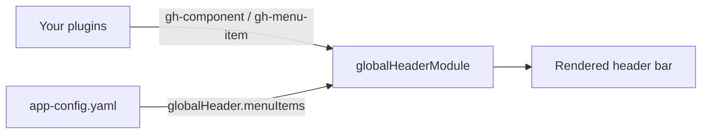

# Extending the Global Header (New Frontend System)

The global header is the top-level navigation bar in Red Hat Developer Hub. It ships with sensible defaults -- a company logo, search, notifications, and user profile -- but is designed to be extended by other plugins and configured by deployers.

This guide explains how to:

- [Set up the header in your app](#setup)
- [Add a button or widget to the toolbar](#add-a-toolbar-component)
- [Add a link or section to a dropdown menu](#add-a-menu-item)
- [Add items from app-config.yaml (no code)](#add-items-from-app-configyaml)
- [Reorder, override, or disable defaults](#customize-defaults)

## How it works

The header uses two extension kinds:

| Kind           | What it contributes                                      | Example                                 |
| -------------- | -------------------------------------------------------- | --------------------------------------- |
| `gh-component` | A toolbar-level element (button, dropdown, logo, spacer) | Search bar, notifications icon          |
| `gh-menu-item` | An item inside a dropdown menu                           | "Settings" link in the profile dropdown |

Extensions are collected at startup, sorted by `priority` (higher = first), and rendered. Menu items from `app-config.yaml` are merged in at runtime.



## Setup

```bash
yarn --cwd packages/app add @red-hat-developer-hub/backstage-plugin-global-header
```

```typescript
// packages/app/src/App.tsx
import { createApp } from '@backstage/frontend-defaults';
import globalHeaderPlugin, {
  globalHeaderModule,
} from '@red-hat-developer-hub/backstage-plugin-global-header/alpha';

export default createApp({
  features: [
    globalHeaderModule, // Collects extensions and renders the header
    globalHeaderPlugin, // Ships the default toolbar + menu items
    // ...your other plugins
  ],
});
```

Both are required. The **module** provides the wrapper; the **plugin** provides the default set of components and menu items.

## Add a toolbar component

Import `GlobalHeaderComponentBlueprint` and call `.make()`. There are three ways to define what renders.

### Option A: Provide data, let the framework render

Supply `icon`, `title`, and `link` (or `onClick`). The framework renders a styled icon button for you.

```typescript
import { GlobalHeaderComponentBlueprint } from '@red-hat-developer-hub/backstage-plugin-global-header/alpha';

export const myButton = GlobalHeaderComponentBlueprint.make({
  name: 'my-button',
  params: {
    icon: 'dashboard',
    title: 'Dashboard',
    link: '/dashboard',
    priority: 75,
  },
});
```

### Option B: Use building-block components

For dropdowns or more control, provide a `component` that uses the exported building blocks (`GlobalHeaderIconButton`, `GlobalHeaderDropdown`).

```typescript
import {
  GlobalHeaderComponentBlueprint,
  GlobalHeaderDropdown,
} from '@red-hat-developer-hub/backstage-plugin-global-header/alpha';

const MyDropdown = () => (
  <GlobalHeaderDropdown
    target="my-links"
    isIconButton
    tooltip="My links"
    buttonContent={<MyIcon />}
  />
);

export const myDropdown = GlobalHeaderComponentBlueprint.make({
  name: 'my-dropdown',
  params: { component: MyDropdown, priority: 75 },
});
```

### Option C: Fully custom component

Pass any React component. You own the rendering entirely.

```typescript
export const myWidget = GlobalHeaderComponentBlueprint.make({
  name: 'my-widget',
  params: {
    component: () => <div>Anything you want</div>,
    priority: 60,
    layout: { flexGrow: 1 }, // MUI sx overrides on the wrapper
  },
});
```

### Parameters reference

| Param       | Type                      | Description                                     |
| ----------- | ------------------------- | ----------------------------------------------- |
| `icon`      | `string`                  | Icon name, inline SVG, or URL                   |
| `title`     | `string`                  | Display title (also tooltip and aria-label)     |
| `titleKey`  | `string`                  | i18n translation key for the title              |
| `tooltip`   | `string`                  | Explicit tooltip (overrides `title`)            |
| `link`      | `string`                  | Navigation URL                                  |
| `onClick`   | `() => void`              | Click handler (mutually exclusive with `link`)  |
| `component` | `ComponentType`           | Custom React component (options B/C)            |
| `priority`  | `number`                  | Sort order -- higher values appear further left |
| `layout`    | `Record<string, unknown>` | MUI `sx` overrides on the wrapper               |

## Add a menu item

Import `GlobalHeaderMenuItemBlueprint`. The `target` field routes the item to the right dropdown:

| Target         | Dropdown             |
| -------------- | -------------------- |
| `profile`      | User profile         |
| `help`         | Help / support       |
| `app-launcher` | Application launcher |

### Data-driven item

Provide `title`, `link`, and optionally `icon` / `sectionLabel`. Items that share a `sectionLabel` are grouped under that heading.

```typescript
import { GlobalHeaderMenuItemBlueprint } from '@red-hat-developer-hub/backstage-plugin-global-header/alpha';

export const docsItem = GlobalHeaderMenuItemBlueprint.make({
  name: 'my-docs',
  params: {
    target: 'help',
    title: 'API Docs',
    icon: 'description',
    link: 'https://api.example.com/docs',
    sectionLabel: 'Documentation',
    priority: 50,
  },
});
```

### Custom component item using building blocks

Use the exported `GlobalHeaderMenuItem` to build a complete, clickable menu item with consistent styling. The component receives `handleClose` and `hideDivider` as props from the dropdown.

```typescript
import {
  GlobalHeaderMenuItemBlueprint,
  GlobalHeaderMenuItem,
} from '@red-hat-developer-hub/backstage-plugin-global-header/alpha';

const MyDocsLink = ({ handleClose }: { handleClose?: () => void }) => (
  <GlobalHeaderMenuItem
    to="https://docs.example.com"
    title="Documentation"
    icon="menu_book"
    onClick={handleClose}
  />
);

export const myDocsItem = GlobalHeaderMenuItemBlueprint.make({
  name: 'my-docs-link',
  params: { target: 'help', component: MyDocsLink, priority: 50 },
});
```

### Fully custom component item

For complete control over rendering, provide any React component. The component receives `handleClose` and `hideDivider` as props.

```typescript
const MySection = ({ handleClose }: { handleClose: () => void }) => (
  <div onClick={handleClose}>Custom content</div>
);

export const mySection = GlobalHeaderMenuItemBlueprint.make({
  name: 'my-section',
  params: { target: 'profile', component: MySection, priority: 50 },
});
```

> If you provide `component` **together with** data fields like `title` or `link`, the item is grouped normally but your component replaces the default renderer.

### Parameters reference

| Param                              | Type            | Description                                     |
| ---------------------------------- | --------------- | ----------------------------------------------- |
| `target`                           | `string`        | **Required.** Which dropdown to add the item to |
| `title` / `titleKey`               | `string`        | Display title / i18n key                        |
| `subTitle` / `subTitleKey`         | `string`        | Secondary line / i18n key                       |
| `icon`                             | `string`        | Icon identifier                                 |
| `link`                             | `string`        | Navigation URL                                  |
| `onClick`                          | `() => void`    | Click handler                                   |
| `component`                        | `ComponentType` | Custom React component                          |
| `priority`                         | `number`        | Sort order -- higher values appear first        |
| `sectionLabel`                     | `string`        | Groups items under a shared heading             |
| `sectionLink` / `sectionLinkLabel` | `string`        | Optional link in the section heading            |

## Registering extensions in your plugin

Include your extensions in `createFrontendPlugin`. They are automatically picked up when the plugin is added to the app.

```typescript
import { createFrontendPlugin } from '@backstage/frontend-plugin-api';
import {
  GlobalHeaderComponentBlueprint,
  GlobalHeaderMenuItemBlueprint,
} from '@red-hat-developer-hub/backstage-plugin-global-header/alpha';

export default createFrontendPlugin({
  pluginId: 'my-plugin',
  extensions: [
    GlobalHeaderComponentBlueprint.make({
      name: 'launch-button',
      params: {
        icon: 'rocket',
        title: 'Launch',
        link: '/launch',
        priority: 75,
      },
    }),
    GlobalHeaderMenuItemBlueprint.make({
      name: 'faq-link',
      params: {
        target: 'help',
        title: 'FAQ',
        link: '/faq',
        icon: 'help',
        priority: 50,
      },
    }),
  ],
});
```

## Add items from app-config.yaml

Deployers can add toolbar buttons and dropdown menu items directly in `app-config.yaml` without writing plugin code.

### Toolbar components

Each entry renders an icon button in the header bar.

```yaml
globalHeader:
  components:
    - title: Dashboard
      icon: dashboard
      link: /dashboard
      tooltip: Open dashboard
      priority: 75
```

`title`, `icon`, and `link` are required. Optional fields: `titleKey`, `tooltip`, `priority`.

### Menu items

Each entry is injected into the dropdown identified by `target`.

```yaml
globalHeader:
  menuItems:
    - target: app-launcher
      title: Internal Wiki
      icon: article
      link: https://wiki.internal.example.com
      sectionLabel: Resources
      priority: 80
```

`target`, `title`, and `link` are required. Optional fields: `titleKey`, `icon`, `sectionLabel`, `sectionLink`, `sectionLinkLabel`, `priority`.

## Customize defaults

Every default extension can be reconfigured, reordered, or disabled via `app-config.yaml`. Extension IDs follow the pattern `<kind>:<plugin-id>/<name>`.

```yaml
app:
  extensions:
    # Change the position of the search bar
    - gh-component:global-header/search:
        config:
          priority: 50

    # Remove notifications
    - gh-component:global-header/notification-button:
        disabled: true

    # Change a menu item's title and link
    - gh-menu-item:global-header/app-launcher-devhub:
        config:
          title: Custom Title
          link: https://custom.example.com
```

### Default toolbar components

Extension ID pattern: `gh-component:global-header/<name>`

| Name                    | Priority | Description                  |
| ----------------------- | -------- | ---------------------------- |
| `company-logo`          | 200      | Company logo                 |
| `search`                | 100      | Search field                 |
| `spacer`                | 99       | Flexible spacer              |
| `self-service-button`   | 90       | Create / self-service button |
| `starred-dropdown`      | 85       | Starred entities dropdown    |
| `app-launcher-dropdown` | 82       | Application launcher         |
| `help-dropdown`         | 80       | Help / support dropdown      |
| `notification-button`   | 70       | Notifications indicator      |
| `divider`               | 50       | Vertical divider             |
| `profile-dropdown`      | 10       | User profile dropdown        |

### Default menu items

Extension ID pattern: `gh-menu-item:global-header/<name>`

| Name                      | Target         | Priority |
| ------------------------- | -------------- | -------- |
| `settings`                | `profile`      | 100      |
| `my-profile`              | `profile`      | 90       |
| `logout`                  | `profile`      | 10       |
| `support-button`          | `help`         | 10       |
| `app-launcher-devhub`     | `app-launcher` | 150      |
| `app-launcher-rhdh-local` | `app-launcher` | 100      |

## Advanced: building blocks and hooks

For plugin authors building custom toolbar components or dropdowns, the plugin exports lower-level building blocks and React hooks:

**Building-block components** (consistent styling without starting from scratch):

| Component                | Key props                        | Purpose                                                                      |
| ------------------------ | -------------------------------- | ---------------------------------------------------------------------------- |
| `GlobalHeaderIconButton` | `title`, `icon`, `to`            | Toolbar icon button that navigates to a URL                                  |
| `GlobalHeaderMenuItem`   | `to`, `title`, `icon`, `onClick` | Complete clickable menu item with link navigation and consistent styling     |
| `GlobalHeaderDropdown`   | `target`, `buttonContent`        | Dropdown that auto-collects `gh-menu-item` extensions for the given `target` |

**Context hooks** (direct access to collected extension data):

| Hook                               | Returns                                    |
| ---------------------------------- | ------------------------------------------ |
| `useGlobalHeaderComponents()`      | All toolbar components, sorted by priority |
| `useGlobalHeaderMenuItems(target)` | Menu items for a specific dropdown target  |

**Translations:** Use `titleKey` / `subTitleKey` for i18n. Keys containing dots (e.g. `'applicationLauncher.sections.documentation'`) are auto-resolved. The plugin exports `globalHeaderTranslationRef` and `globalHeaderTranslations` for overrides.

All exports are available from `@red-hat-developer-hub/backstage-plugin-global-header/alpha`.
