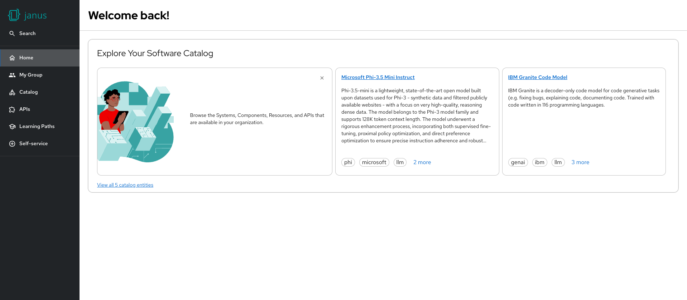
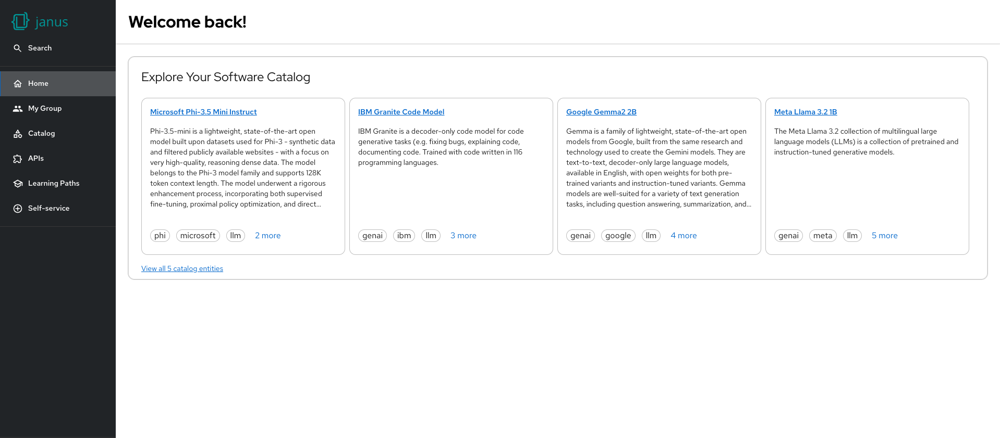

# Entity section card

Entity Section Card is a UI component designed for the RHDH homepage experience. It provides a visually engaging section to highlight catalog entities of various kinds, such as components, APIs, resources, and more.

> 📌 This card is part of the new dynamic homepage experience introduced in the UX refresh. It can be enabled via the dynamic plugin configuration.




## Example

```yaml
dynamicPlugins:
  frontend:
    red-hat-developer-hub.backstage-plugin-dynamic-home-page:
      mountPoints:
        - mountPoint: home.page/cards
          importName: EntitySection
          config:
            layouts:
              xl: { w: 12, h: 7 }
              lg: { w: 12, h: 7 }
              md: { w: 12, h: 8 }
              sm: { w: 12, h: 9 }
              xs: { w: 12, h: 11 }
              xxs: { w: 12, h: 15 }
```
