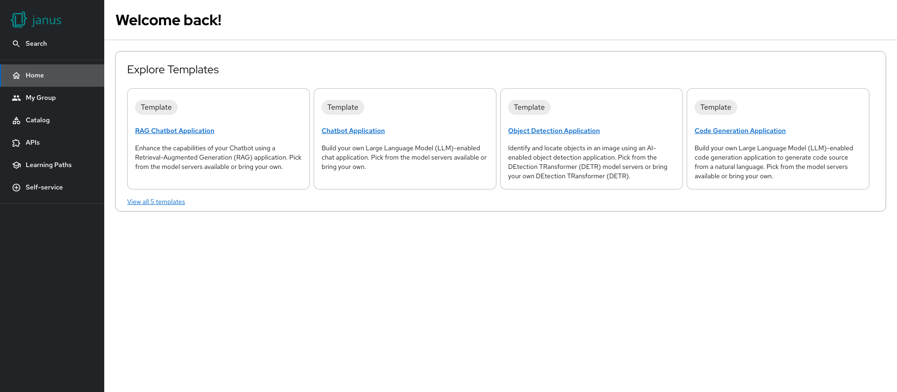

# Template section card

The Template Section Card enables users to quickly explore and initiate software templates in RHDH.

> 🚀 Perfect for accelerating software delivery by helping users jumpstart new projects using curated templates.



## Example

```yaml
dynamicPlugins:
  frontend:
    red-hat-developer-hub.backstage-plugin-dynamic-home-page:
      mountPoints:
        - mountPoint: home.page/cards
          importName: TemplateSection
          config:
            layouts:
              xl: { w: 12, h: 5 }
              lg: { w: 12, h: 5 }
              md: { w: 12, h: 5 }
              sm: { w: 12, h: 5 }
              xs: { w: 12, h: 5 }
              xxs: { w: 12, h: 14 }
```
