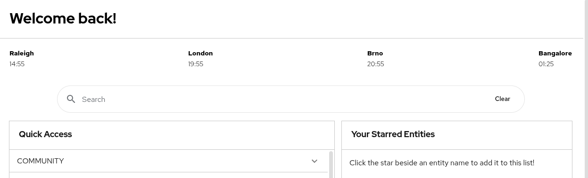

# World clock

> [!NOTE]
> This feature is added Dynamic Home Page plugin 1.1 (RHDH 1.5).

The world clock component (thanks again to the upstream Home plugin) is a great way show show multiple timezones on the home page!



## Examples

```yaml
dynamicPlugins:
  frontend:
    red-hat-developer-hub.backstage-plugin-dynamic-home-page:
      mountPoints:
        - mountPoint: home.page/cards
          importName: WorldClock
          config:
            layouts:
              xl: { w: 12, h: 1 }
              lg: { w: 12, h: 1 }
              md: { w: 12, h: 1 }
              sm: { w: 12, h: 1 }
              xs: { w: 12, h: 1 }
              xxs: { w: 12, h: 1 }
            props:
              worldClocks:
                - label: Raleigh
                  timeZone: EST
                - label: London
                  timeZone: GMT
                - label: Brno
                  timeZone: CET
                - label: Bangalore
                  timeZone: IST
```

## Available props

| Prop             | Default         | Description                                                                                                    |
| ---------------- | --------------- | -------------------------------------------------------------------------------------------------------------- |
| `worldClocks`    | none            | The world clocks must be an array with two properties: `label` and `timeZone` as shown in the example.         |
| `timeFormat`     | none            | An object to show additional parts of the date. Use `day: 2-digit` and `month: 2-digit` to show also the date. |
| `justifyContent` | `space-between` | A CSS option to add spacing around the clocks (`space-around`) or just between the clocks (`space-between`).   |
