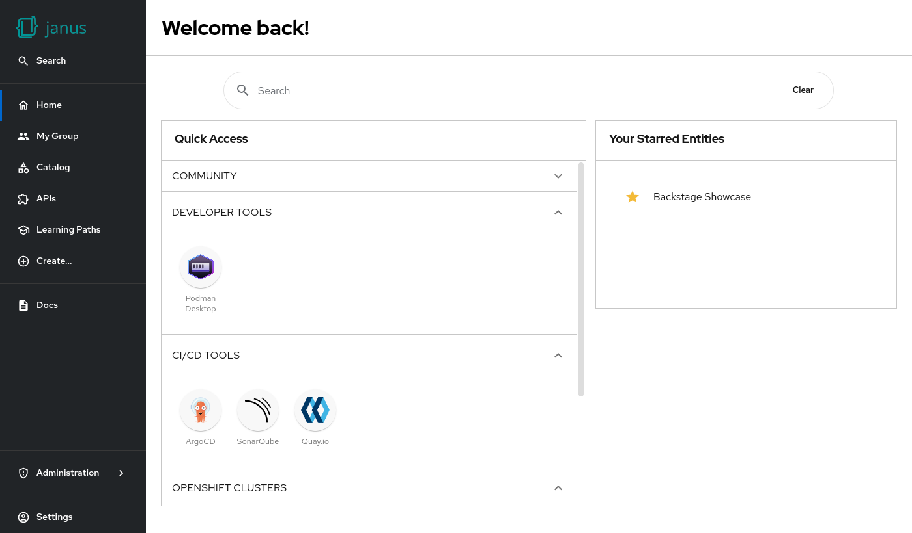

# Defaults

The dynamic home page allows admins to customize the homepage in the `app-config`, and plugin authors to extend the home page with additional cards or content.

Additional cards can automatically appear based on installed and enabled plugins.

## Homepage Components

The plugin provides two main components:

- **`DynamicHomePage`** - A read-only homepage that displays configured cards without user customization
- **`DynamicCustomizableHomePage`** - An interactive homepage that allows users to add, remove, move, and resize cards

## Default home page

The default home page shows a "Onboarding Section" card, a "Entity Section" card, and a "Template Section" card by default.



The customization can happen in any loaded `app-config` from the `dynamicPlugins` section.

The home page loads automatically a configuration like this, when no other configiration is passed:

### Read-only Homepage

```yaml
dynamicPlugins:
  frontend:
    red-hat-developer-hub.backstage-plugin-dynamic-home-page:
      dynamicRoutes:
        - path: /
          importName: DynamicHomePage
      mountPoints:
        - mountPoint: home.page/cards
          importName: OnboardingSection
          config:
            layouts:
              xl: { w: 12, h: 6 }
              lg: { w: 12, h: 6 }
              md: { w: 12, h: 7 }
              sm: { w: 12, h: 8 }
              xs: { w: 12, h: 9 }
              xxs: { w: 12, h: 14 }
        - mountPoint: home.page/cards
          importName: EntitySection
          config:
            layouts:
              xl: { w: 12, h: 7 }
              lg: { w: 12, h: 7 }
              md: { w: 12, h: 8 }
              sm: { w: 12, h: 9 }
              xs: { w: 12, h: 11 }
              xxs: { w: 12, h: 15 }
        - mountPoint: home.page/cards
          importName: TemplateSection
          config:
            layouts:
              xl: { w: 12, h: 5 }
              lg: { w: 12, h: 5 }
              md: { w: 12, h: 5 }
              sm: { w: 12, h: 5 }
              xs: { w: 12, h: 7.5 }
              xxs: { w: 12, h: 13.5 }
```

### Customizable Homepage

For an interactive homepage where users can add, remove, move, and resize cards:

```yaml
dynamicPlugins:
  frontend:
    red-hat-developer-hub.backstage-plugin-dynamic-home-page:
      dynamicRoutes:
        - path: /
          importName: DynamicCustomizableHomePage
      mountPoints:
        - mountPoint: home.page/cards
          importName: OnboardingSection
          config:
            layouts:
              xl: { w: 12, h: 6 }
              lg: { w: 12, h: 6 }
              md: { w: 12, h: 7 }
              sm: { w: 12, h: 8 }
              xs: { w: 12, h: 9 }
              xxs: { w: 12, h: 14 }
        - mountPoint: home.page/cards
          importName: EntitySection
          config:
            layouts:
              xl: { w: 12, h: 7 }
              lg: { w: 12, h: 7 }
              md: { w: 12, h: 8 }
              sm: { w: 12, h: 9 }
              xs: { w: 12, h: 11 }
              xxs: { w: 12, h: 15 }
        - mountPoint: home.page/cards
          importName: TemplateSection
          config:
            layouts:
              xl: { w: 12, h: 5 }
              lg: { w: 12, h: 5 }
              md: { w: 12, h: 5 }
              sm: { w: 12, h: 5 }
              xs: { w: 12, h: 7.5 }
              xxs: { w: 12, h: 13.5 }
        # Additional cards available in "Add widget" dialog
        - mountPoint: home.page/cards
          importName: RecentlyVisitedCard
        - mountPoint: home.page/cards
          importName: TopVisitedCard
```

The customizable homepage provides:

- **Drag and drop** - Move cards around the layout
- **Resize** - Adjust card dimensions
- **Add widget** - Select from available cards to add to the homepage
- **Remove cards** - Delete cards from the homepage
- **Restore defaults** - Reset to the original card configuration
- **User persistence** - Settings are saved per user using Backstage's Storage API

## Adding cards from a plugin

Plugins can add additional cards/content by exporting a react component.

Each card can have a `layouts` definition and `props` that are depending on the used component like this:

```yaml
dynamicPlugins:
  frontend:
    red-hat-developer-hub.backstage-plugin-dynamic-home-page:
      mountPoints:
        - mountPoint: home.page/cards
          importName: Headline
          config:
            layouts:
              xl: { h: 1 }
              lg: { h: 1 }
              md: { h: 1 }
              sm: { h: 1 }
              xs: { h: 1 }
              xxs: { h: 1 }
            props:
              title: Important info
```
