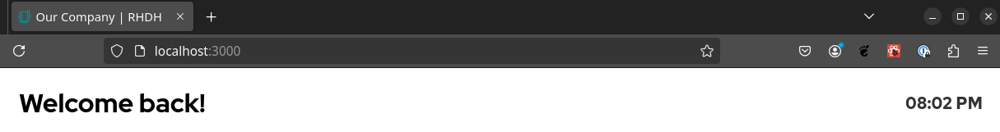

# Header

<!--
> [!CAUTION]
> The default view in RHDH might differ slightly from this. While writing this it was not clear if we want show the username and time by default or not.
-->

## Title

The header title shows by default the message "Welcome back!".


<!--
The header title shows by default time three different welcome messages to the user based on the local time:

| Time          | Message                        |
| ------------- | ------------------------------ |
| 0 am - 11 am  | Good morning {{firstName}}   |
| 12 pm - 4 pm  | Good afternoon {{firstName}} |
| 5 pm to 11 pm | Good evening {{firstName}}   |

The `{{firstName}}` variable is automatically replaced with the first part (seperated by a space) of the users `displayName`.


This requires that the User catalog entity contains a profile name like this:

```yaml
apiVersion: backstage.io/v1alpha1
kind: User
metadata:
  name: joe-doe
spec:
  profile:
    displayName: Joe Doe
```
-->

The title can be changed by overriding the `title` property of the dynamic home page plugin:

```yaml
dynamicPlugins:
  frontend:
    red-hat-developer-hub.backstage-plugin-dynamic-home-page:
      dynamicRoutes:
        - path: /
          importName: DynamicHomePage # or DynamicCustomizableHomePage for customizable homepage
          config:
            props:
              title: 'Howdy {{firstName}} or {{dispayName}}'
```

The example will show:


The `title` property support currently two variables:

- `{{displayName}}` contains the full `displayName` of the user catalog entity.
- `{{firstName}}` contains the first part (seperated by a space) of the users `displayName`.

There is currently no option to define different titles per hour.

### Subtitle

You can also use a `subtitle` property which isn't used by default:

```yaml
dynamicPlugins:
  frontend:
    red-hat-developer-hub.backstage-plugin-dynamic-home-page:
      dynamicRoutes:
        - path: /
          importName: DynamicHomePage # or DynamicCustomizableHomePage
          config:
            props:
              title: Our custom RHDH instance
              subtitle: 'Hello {{dispayName}}'
```


The `subtitle` supports the same two variables as the `title`.

### Personalized title

Some titles might look just good if the users have or have not a profile `displayName` in their catalog `User` entity. To avoid an unnecessary space in "Welcome to your RHDH instance {{firstName}}!" when the firstname is not available, admins can configure the title separately for the case that the `displayName` is available (`personalizedTitle`) or not (`title`). `title` is always used as a fallback if `personalizedTitle` isn't configured.

```yaml
dynamicPlugins:
  frontend:
    red-hat-developer-hub.backstage-plugin-dynamic-home-page:
      dynamicRoutes:
        - path: /
          importName: DynamicHomePage # or DynamicCustomizableHomePage
          config:
            props:
              title: Welcome to your RHDH instance!
              personalizedTitle: Welcome to your RHDH instance {{firstName}}!
```

For users without a `displayName`:


For users with a `displayName`:


### Page title

The page title could override the header title to display a slightly different text in the browser tab.

```yaml
dynamicPlugins:
  frontend:
    red-hat-developer-hub.backstage-plugin-dynamic-home-page:
      dynamicRoutes:
        - path: /
          importName: DynamicHomePage # or DynamicCustomizableHomePage
          config:
            props:
              title: Welcome back!
              pageTitle: Our Company
```



### Available props

| Prop                | Default | Description                                                                                                                                                      |
| ------------------- | ------- | ---------------------------------------------------------------------------------------------------------------------------------------------------------------- |
| `title`             | none    | Change the header title, can contain `{{displayName}}` or `{{firstName}}` to include the current user. This requires a `displayName` in the user catalog entity. |
| `subtitle`          | none    | The smaller subtitle supports the same variables as the title.                                                                                                   |
| `personalizedTitle` | none    | An optional property to override the `title` if you like to differentiate users with and without a `displayName`. See example above.                             |
| `pageTitle`         | none    | An optional property to override the title that is displayed in the browser tab.                                                                                 |

## Local clock

Starting with Dynamic Home Page plugin 1.1 (RHDH 1.5) the home page header can show the current time in the header.

The local time can be disabled or configured with a `localClock` object. This object supports three properties: `label`, `format`, and `lang`. All of them are optional.

To show the current time you must specific at least the `format`:

```yaml
dynamicPlugins:
  frontend:
    red-hat-developer-hub.backstage-plugin-dynamic-home-page:
      dynamicRoutes:
        - path: /
          importName: DynamicHomePage # or DynamicCustomizableHomePage
          config:
            props:
              localClock:
                format: time
```


Showing the current date instead of time:

```yaml
dynamicPlugins:
  frontend:
    red-hat-developer-hub.backstage-plugin-dynamic-home-page:
      dynamicRoutes:
        - path: /
          importName: DynamicHomePage # or DynamicCustomizableHomePage
          config:
            props:
              localClock:
                format: date
```


You can pick up more options like `both`, `full`, etc. The full list is available below.

By default the format is based on the browser language settings. You can enforce a language setting with `lang`:

```yaml
dynamicPlugins:
  frontend:
    red-hat-developer-hub.backstage-plugin-dynamic-home-page:
      dynamicRoutes:
        - path: /
          importName: DynamicHomePage # or DynamicCustomizableHomePage
          config:
            props:
              localClock:
                format: full
                lang: de
```


There is also an option to specify a label shown above the time. This is especially useful if you like to show additional times (see the world clock section below).

```yaml
dynamicPlugins:
  frontend:
    red-hat-developer-hub.backstage-plugin-dynamic-home-page:
      dynamicRoutes:
        - path: /
          importName: DynamicHomePage # or DynamicCustomizableHomePage
          config:
            props:
              localClock:
                format: time
                label: Local
```


### Available props

| Prop                | Default | Description                                                                                                                                                    |
| ------------------- | ------- | -------------------------------------------------------------------------------------------------------------------------------------------------------------- |
| `localClock.format` | `none`  | One of the options `none`, `time`, `timewithseconds`, `date`, `datewithweekday`, `both`, or `full` is currently supported. Other options will show the `time`. |
| `localClock.lang`   | none    | The date and time format depends by default on the browser settings. The `lang` can enforce the same output format for all users.                              |
| `localClock.label`  | none    | Optional label that is shown on top of the local time.                                                                                                         |

`localClock.format`:

| Format            | Example, the output depends on the browser language |
| ----------------- | --------------------------------------------------- |
| `none`            | -                                                   |
| `time`            | 01:14 PM                                            |
| `timewithseconds` | 01:14:15 PM                                         |
| `date`            | 01/01/2025                                          |
| `datewithweekday` | Wednesday, 01/01/2025                               |
| `both`            | 01/01/2025, 01:14 PM                                |
| `full`            | Wednesday, 01/01/2025, 01:14 PM                     |

## World clock

Also added with Dynamic Home Page plugin 1.1 (RHDH 1.5) the header can include additional clocks/timezones.

The world clock option (thanks to the upstream home plugin) provides you the option to show multiple timezones on the home page header.

```yaml
dynamicPlugins:
  frontend:
    red-hat-developer-hub.backstage-plugin-dynamic-home-page:
      dynamicRoutes:
        - path: /
          importName: DynamicHomePage # or DynamicCustomizableHomePage
          config:
            props:
              worldClocks:
                - label: Raleigh
                  timeZone: EST
                - label: London
                  timeZone: GMT
                - label: Brno
                  timeZone: CET
                - label: Bangalore
                  timeZone: IST
```


### Available props

| Prop          | Default | Description                                                                                            |
| ------------- | ------- | ------------------------------------------------------------------------------------------------------ |
| `worldClocks` | none    | The world clocks must be an array with two properties: `label` and `timeZone` as shown in the example. |
