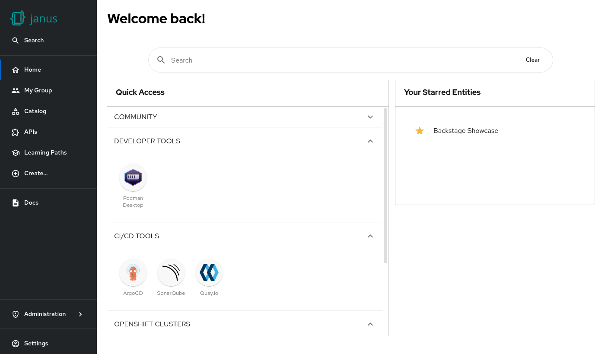

# RHDH Home Page plugin

The RHDH home page plugin is based on the upstream [home plugin](https://github.com/backstage/backstage/blob/master/plugins/home/README.md).

It allows primarily **admins** to customize the homepage in the `app-config`, and plugin authors to extend the home page with additional cards or content.

## Key Features

- **Dual Mount Point System**: Separate default cards from plugin-contributed cards
- **Config-Based Metadata**: Add titles and descriptions directly in YAML configuration
- **Customizable Grid**: Drag-and-drop, resizable cards with "Add widget" functionality
- **Plugin Integration**: Easy integration for external plugins via configuration

## Mount Points

The plugin supports two mount points:

- **`home.page/cards`** - Default homepage cards that appear by default
- **`home.page/widgets`** - Additional cards contributed by other plugins that appear in the "Add widget" dialog

## Configuration-Based Metadata

Cards can have titles and descriptions defined directly in the configuration:

```yaml
dynamicPlugins:
  frontend:
    your-plugin:
      mountPoints:
        - mountPoint: home.page/widgets
          importName: YourCard
          config:
            title: 'Your Card Title'
            description: 'Description shown in Add widget dialog'
```

The default home page shows a Search input field, a "Quick Access" card, and a "Your Starred Entities" card by default.

Additional cards can automatically appear based on installed and enabled plugins.


