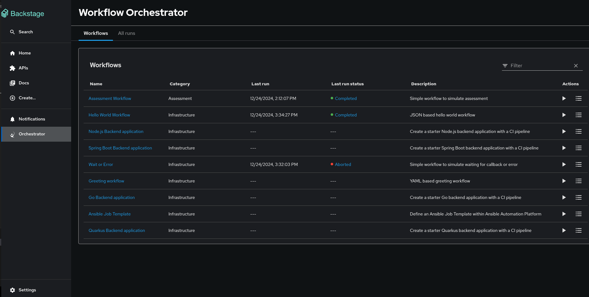

# Orchestrator Plugin for Backstage

The Orchestrator for Backstage is a mechanism designed to facilitate the implementation and execution of developer self-service flows. It serves as a vital component that enhances and augments the existing scaffolder functionality of Backstage with a more flexible and powerful set of features including long-running and asynchronous flows.

The orchestrator works harmoniously with other Backstage components such as the Software Catalog, permissions, and plugins as well as others. By leveraging its capabilities, organizations can orchestrate and coordinate developer self-service flows effectively.

## Context

The Backstage Orchestrator plugin aims to provide a better option to Scaffolder, based on workflows to have a more flexible and powerful tool that addresses the need by streamlining and automating processes, allowing developers to focus more on coding and innovation.

The orchestrator relies on [SonataFlow](https://sonataflow.org/), a powerful tool for building cloud-native workflow applications.

The main idea is to keep the same user experience for users, leveraging the UI components, input forms, and flow that Scaffolder provides, this way it should be straightforward for users and transparent no matter whether using Templates or Workflows, both can live together being compatible with integration points.

The orchestrator controls the flow orchestrating operations/tasks that may be executed in any external service including Scaffolder Actions, this way it is possible to leverage any existing Action hence Software Templates can be easily migrated to workflows opening the door to extend them to more complex use cases.

## Capabilities

**Advanced core capabilities**

- Stateful/long-lived
- Branching and parallelism
- Error management and compensation
- Event-driven supporting [CloudEvents](https://cloudevents.io)
- Audit logging
- Sub-flows
- Choreography
- Timer/timeout control
- Built-in powerful expression evaluation with JQ
- Low Code/No code
- Cloud-native architecture Kubernetes/OpenShift with Operator support
- OpenAPI / REST built-in integration etc.

**Client-side tooling**

- Orchestration visualization / graphical editor
- Integration with service catalog/actions
- GitHub integration
- Form generation
- Runtime monitoring of instances
- Dashboards
- Potential custom integrations (user interaction, notifications, etc.)


## Devmode config


## Install as a static plugin and run locally

### Prerequisites

- Docker up and running

Follows these instructions to install the orchestrator plugin on your own backstage environment. These instructions assume your code structure has the standard [backstage app structure](https://backstage.io/docs/getting-started/).

### Setting up the Orchestrator backend package

1. Install the Orchestrator backend plugin using the following command:

   ```console
   yarn workspace backend add @red-hat-developer-hub/backstage-plugin-orchestrator-backend
   ```

2. Add the following code to the `packages/backend/src/index.ts` file:

   ```ts title="packages/backend/src/index.ts"
   const backend = createBackend();

   /* highlight-add-next-line */
   backend.add(
     import('@red-hat-developer-hub/backstage-plugin-orchestrator-backend'),
   );

   backend.start();
   ```

### Setting up the Orchestrator frontend package

1. Install the Orchestrator frontend plugin using the following command:

   ```console
   yarn workspace app add @red-hat-developer-hub/backstage-plugin-orchestrator
   ```

2. Add a route to the `OrchestratorPage` and the customized template card component to Backstage App (`packages/app/src/App.tsx`):

   ```tsx title="packages/app/src/App.tsx"
   /* highlight-add-next-line */
   import { OrchestratorPage } from '@red-hat-developer-hub/backstage-plugin-orchestrator';

   const routes = (
     <FlatRoutes>
       {/* ... */}
       {/* highlight-add-next-line */}
       <Route path="/orchestrator" element={<OrchestratorPage />} />
     </FlatRoutes>
   );
   ```

3. Add the Orchestrator to Backstage sidebar (`packages/app/src/components/Root/Root.tsx`):

   ```tsx title="packages/app/src/components/Root/Root.tsx"
   /* highlight-add-next-line */
   import { OrchestratorIcon } from '@red-hat-developer-hub/backstage-plugin-orchestrator';

   export const Root = ({ children }: PropsWithChildren<{}>) => (
     <SidebarPage>
       <Sidebar>
         <SidebarGroup label="Menu" icon={<MenuIcon />}>
           {/* ... */}
           {/* highlight-add-start */}
           <SidebarItem
             icon={OrchestratorIcon}
             to="orchestrator"
             text="Orchestrator"
           />
           {/* highlight-add-end */}
         </SidebarGroup>
         {/* ... */}
       </Sidebar>
       {children}
     </SidebarPage>
   );
   ```


## Install as a dynamic plugin in Red Hat Developer Hub
Follow [these guidelines](https://github.com/rhdhorchestrator/orchestrator-helm-operator/blob/main/docs/release-1.3/existing-rhdh.md#install-the-orchestrator-operator) to install the orchestrator operator and configure the orchestrator as a dynamic plugin in Red Hat Developer Hub.

## Configuration

### Configuration for running locally

```yaml title="app-config.yaml"
backend:
  csp:
    frame-ancestors: ['http://localhost:3000', 'http://localhost:7007']
    script-src: ["'self'", "'unsafe-inline'", "'unsafe-eval'"]
    script-src-elem: ["'self'", "'unsafe-inline'", "'unsafe-eval'"]
    connect-src: ["'self'", 'http:', 'https:', 'data:']
orchestrator:
  sonataFlowService:
    baseUrl: http://localhost
    port: 8899
    autoStart: true
    workflowsSource:
      gitRepositoryUrl: https://github.com/parodos-dev/backstage-orchestrator-workflows
      localPath: /tmp/orchestrator/repository
  dataIndexService:
    url: http://localhost:8899
```

This configuration will trigger the following:
1. Cloning https://github.com/parodos-dev/backstage-orchestrator-workflows to /tmp/orchestrator/repository.
2. Running the sonataflow devmode container configured to load the workflows located in /tmp/orchestrator/repository.

> **Note:** /tmp/orchestrator needs to be available to docker.

The csp headers are required for the Workflow viewer to load.


## User interface

The user interface is accessible via the orchestrator button added in the Backstage sidebar. It provides a list of workflows and workflow runs, and an option to run the workflow and view the result.




## Orchestrator API

The plugin provides OpenAPI `v2` endpoints definition to facilitate communication between the frontend and backend. This approach minimizes the data that needs to be sent to the frontend, provides flexibility and avoids dependencies on changes in the [CNCF serverless specification](https://github.com/serverlessworkflow/specification/blob/main/specification.md).

The OpenAPI specification file is availabe [here](./plugins/orchestrator-common/src/openapi/openapi.yaml).

The OpenAPI specification documentation is available [here](./plugins/orchestrator-common/src/generated/docs/markdown/README.md)

The plugin provides an auto generated typescript client that can be used to call the API. To use it include the @red-hat-developer-hub/backstage-plugin-orchestrator-common plugin in your project. Refer to [OrchestratorClient.ts](./plugins/orchestrator/src/api/OrchestratorClient.ts#L59) as an example for how to use it.


## audit log

The orchestrator backend has audit logs for all incoming requests.

For more information about audit logs in RHDH, please refer to [the official documentation](https://docs.redhat.com/en/documentation/red_hat_developer_hub/1.2/html/getting_started_with_red_hat_developer_hub/assembly-audit-log#con-audit-log-config_assembly-audit-log).
[The official Log storage OpenShift documentation](https://docs.openshift.com/container-platform/4.15/observability/logging/log_storage/about-log-storage.html) may also be of interest.

## Extensible workflow execution form

The `orchestrator` plugin includes an extensible form for executing workflows. For detailed guidance see the [Extensible Workflow Execution Form Documentation]().


## Maintainers
Follow these [instructions and guidelines](./Maintainers.md).