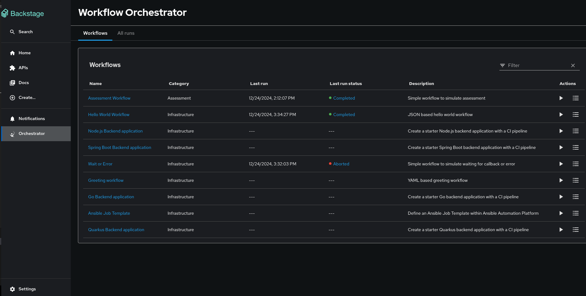

# Orchestrator Plugin for Backstage

The Orchestrator for Backstage is designed to enable self-service flows. It serves as a vital component that enhances and augments the existing scaffolder functionality of Backstage with a more flexible and powerful set of features including long-running and asynchronous flows.

The Backstage Orchestrator plugin aims to provide a better option to Scaffolder, based on workflows to have a more flexible and powerful tool that addresses the need by streamlining and automating processes, allowing developers to focus more on coding and innovation.

It utilizes [SonataFlow](https://sonataflow.org/), a powerful tool for building cloud-native workflow applications.

## Architecture Overview

The architecture adheres to standard Backstage plugin guidelines and requires the following plugins to be installed for proper functionality:

1. **`backstage-plugin-orchestrator`**

   - Provides the frontend interface.

2. **`backstage-plugin-orchestrator-backend`**
   - Serves as a backend proxy between Backstage and SonataFlow.

These plugins farther import following isolated plugins:

1. **`backstage-plugin-orchestrator-swf-editor-envelope`**

   - Hosts the workflow viewer.

2. **`backstage-plugin-orchestrator-common`**

   - Contains the backend OpenAPI specification along with autogenerated API documentation and client libraries.

3. **`backstage-plugin-orchestrator-form`**

   - Provides the workflow execution form.

4. **`backstage-plugin-orchestrator-form-api`**

   - Defines the API for extending the workflow execution form.
   - For more details, see the [Extensible Form Documentation](./docs/extensibleForm.md).

5. **`backstage-plugin-orchestrator-form-widgets`**

   - Provides the workflow execution form custom widgets.

For more details about architecture, see the [Architecture](https://www.rhdhorchestrator.io/main/docs/architecture/) page.

## Install as a static plugin

Follows these instructions to install the orchestrator plugin in a backstage environment. These instructions assume the code structure has the standard [backstage app structure](https://backstage.io/docs/getting-started/).

### Setting up the Orchestrator backend package

1. Install the Orchestrator backend plugin using the following command:

   ```console
   yarn workspace backend add @red-hat-developer-hub/backstage-plugin-orchestrator-backend
   ```

2. Add the following code to the `packages/backend/src/index.ts` file:

   ```ts title="packages/backend/src/index.ts"
   const backend = createBackend();

   /* highlight-add-next-line */
   backend.add(
     import('@red-hat-developer-hub/backstage-plugin-orchestrator-backend'),
   );

   backend.start();
   ```

### Setting up the Orchestrator frontend package

1. Install the Orchestrator frontend plugin using the following command:

   ```console
   yarn workspace app add @red-hat-developer-hub/backstage-plugin-orchestrator
   ```

2. Add a route to the `OrchestratorPage` and the customized template card component to Backstage App (`packages/app/src/App.tsx`):

   ```tsx title="packages/app/src/App.tsx"
   /* highlight-add-next-line */
   import { OrchestratorPage } from '@red-hat-developer-hub/backstage-plugin-orchestrator';

   const routes = (
     <FlatRoutes>
       {/* ... */}
       {/* highlight-add-next-line */}
       <Route path="/orchestrator" element={<OrchestratorPage />} />
     </FlatRoutes>
   );
   ```

3. Add the Orchestrator to Backstage sidebar (`packages/app/src/components/Root/Root.tsx`):

   ```tsx title="packages/app/src/components/Root/Root.tsx"
   /* highlight-add-next-line */
   import { OrchestratorIcon } from '@red-hat-developer-hub/backstage-plugin-orchestrator';

   export const Root = ({ children }: PropsWithChildren<{}>) => (
     <SidebarPage>
       <Sidebar>
         <SidebarGroup label="Menu" icon={<MenuIcon />}>
           {/* ... */}
           {/* highlight-add-start */}
           <SidebarItem
             icon={OrchestratorIcon}
             to="orchestrator"
             text="Orchestrator"
           />
           {/* highlight-add-end */}
         </SidebarGroup>
         {/* ... */}
       </Sidebar>
       {children}
     </SidebarPage>
   );
   ```

## Install as a dynamic plugin in Red Hat Developer Hub

Follow [these guidelines](https://github.com/rhdhorchestrator/orchestrator-helm-operator/blob/main/docs/release-1.3/existing-rhdh.md#install-the-orchestrator-operator) to install the orchestrator operator and configure the orchestrator as a dynamic plugin in Red Hat Developer Hub.

## Configuration

### Devmode local configuration

This configuration serves for running the application locally for development purposes.

#### Prerequisites

- Docker up and running

####

```yaml title="app-config.yaml"
backend:
  csp:
    frame-ancestors: ['http://localhost:3000', 'http://localhost:7007']
    script-src: ["'self'", "'unsafe-inline'", "'unsafe-eval'"]
    script-src-elem: ["'self'", "'unsafe-inline'", "'unsafe-eval'"]
    connect-src: ["'self'", 'http:', 'https:', 'data:']
orchestrator:
  sonataFlowService:
    baseUrl: http://localhost
    port: 8899
    autoStart: true
    workflowsSource:
      gitRepositoryUrl: https://github.com/rhdhorchestrator/backstage-orchestrator-workflows
      localPath: /tmp/orchestrator/repository
  dataIndexService:
    url: http://localhost:8899
```

This configuration will trigger the following:

1. Cloning https://github.com/rhdhorchestrator/backstage-orchestrator-workflows to /tmp/orchestrator/repository.
2. Running the SonataFlow devmode container configured to load the workflows located in /tmp/orchestrator/repository.

> **Note:** /tmp/orchestrator needs to be accessible to docker.

### Production configuration

```yaml title="app-config.yaml"
backend:
  csp:
    script-src: ["'self'", "'unsafe-inline'", "'unsafe-eval'"]
    script-src-elem: ["'self'", "'unsafe-inline'", "'unsafe-eval'"]
    connect-src: ["'self'", 'http:', 'https:', 'data:']
orchestrator:
  dataIndexService:
    url: <url to SonataFlow data index>
```

The csp headers are required for the Workflow viewer to load.

## User interface

The user interface is accessible via the orchestrator button added in the Backstage sidebar. It provides a list of workflows and the option to run the workflows and view the results.



## Permissions

The Orchestrator plugin protects its backend endpoints with the builtin permission mechanism and combines it with
the RBAC plugin. The result is control over what users can see or execute. Details available [here](./docs/Permissions.md).

## Orchestrator API

The backend plugin provides OpenAPI `v2` endpoints definition.

The OpenAPI specification file is available in the [openapi spec file](./plugins/orchestrator-common/src/openapi/openapi.yaml).

Documentation is available in the autogenerated [documentation](./plugins/orchestrator-common/src/generated/docs/markdown/README.md)

The plugin provides an auto generated typescript client that can be used to call the API. To use it include the @red-hat-developer-hub/backstage-plugin-orchestrator-common plugin in your project. You can see in the [OrchestratorClient.ts](./plugins/orchestrator/src/api/OrchestratorClient.ts#L59) how the client can be used.

## scaffolder-backend-module-orchestrator

To call workflows from a [Backstage software template](https://backstage.io/docs/features/software-templates/), additional [custom actions](https://backstage.io/docs/features/software-templates/writing-custom-actions) need to be deployed.

Their implementation lives in the [plugins/scaffolder-backend-module-orchestrator](./plugins/scaffolder-backend-module-orchestrator) module.

## Audit log

The orchestrator backend has audit logs for all incoming requests.

For more information about audit logs in RHDH, please refer to [the official documentation](https://docs.redhat.com/en/documentation/red_hat_developer_hub/1.4/html/audit_log/assembly-audit-log).
[The official Log storage OpenShift documentation](https://docs.openshift.com/container-platform/4.15/observability/logging/log_storage/about-log-storage.html) may also be of interest.

## Extensible workflow execution form

The `orchestrator` plugin includes an extensible form for executing workflows. Details are available in the [extensible form documentation](./docs/extensibleForm.md).

## Run locally from this repo

The orchestrator workspace is structured like a standard backstage application. To get it up and running locally run the following:

```
cd workspaces/orchestrator
yarn install
yarn dev
```

This will trigger a docker container run of devmode SonataFlow as described in [Devmode local configuration](#devmode-local-configuration).

More development guidelines available in the [contributors documentation](./docs/Contributors.md).

## Enable in rhdh repo locally

If you're running a local clone of [Red Hat Developer Hub (RHDH)](https://github.com/redhat-developer/rhdh) and want to use the Orchestrator plugin as a dynamic plugin, we've included a helper script to streamline this setup.

Please refer to the [Enabling the Orchestrator Plugin in rhdh repo locally](./workspaces/orchestrator/README.md#-enabling-the-orchestrator-plugin-in-red-hat-developer-hub) section for detailed instructions.
