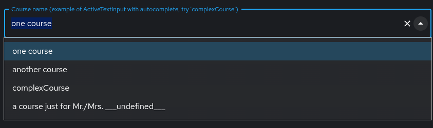
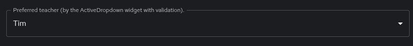
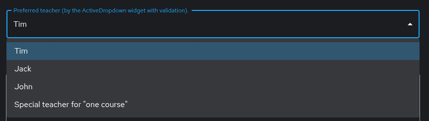
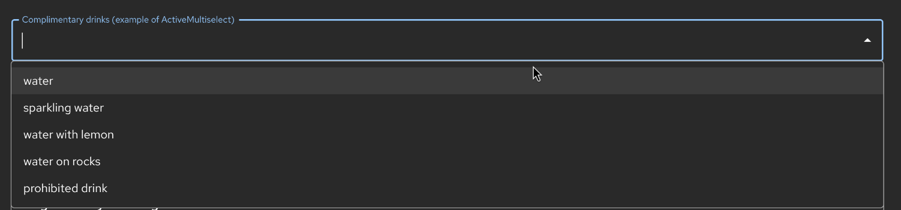
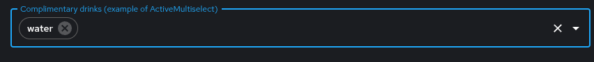
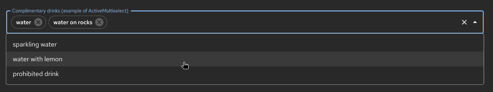

# The orchestrator-form-widgets library

This library provides default, but optional, RJSF form widgets for the Orchestrator workflow execution page.
The library is supplied through the `orchestrator-form-widgets` front-end plugin.

## Development of a workflow using orchestrator-form-widgets

Developing workflows with the `orchestrator-form-widgets` follows principles similar to standard workflow creation, with one critical enhancement: the ability to incorporate dynamic UI elements via the `ui:widget` property in your data input schema.

Key Differentiators:

- Dynamic UI Integration: Reference custom UI widgets directly in your schema using `ui:widget`, enabling interactive components like `ActiveTextInput` or `ActiveDropdown`.
- Backend Flexibility: A live HTTP server is required to:
  - Serve JSON Schema snippets for the SchemaUpdater.
  - Provide default data or option lists.
  - Handle complex validation logic for widgets.

Implementation of the HTTP endpoints is out of the scope of this library, they are expected to be custom developed to match rules and data sources of target environment.

## Table of Content

- [The orchestrator-form-widgets library](#the-orchestrator-form-widgets-library)
  - [Development of a workflow using orchestrator-form-widgets](#development-of-a-workflow-using-orchestrator-form-widgets)
  - [Table of Content](#table-of-content)
  - [Context](#context)
  - [Deployment considerations](#deployment-considerations)
  - [SchemaUpdater widget](#schemaupdater-widget)
    - [Example of the SchemaUpdater use in workflow's input data schema](#example-of-the-schemaupdater-use-in-workflows-input-data-schema)
    - [Expected response for the SchemaUpdater](#expected-response-for-the-schemaupdater)
    - [Using selector to narrow complex response in SchemaUpdater](#using-selector-to-narrow-complex-response-in-schemaupdater)
    - [Default mandatory data](#default-mandatory-data)
    - [SchemaUpdater widget ui:props](#schemaupdater-widget-uiprops)
  - [ActiveTextInput widget](#activetextinput-widget)
    - [ActiveTextInput Data fetching](#activetextinput-data-fetching)
    - [ActiveTextInput Data validation](#activetextinput-data-validation)
    - [Autocomplete](#autocomplete)
    - [ActiveTextInput widget ui:props](#activetextinput-widget-uiprops)
  - [ActiveDropdown widget](#activedropdown-widget)
    - [ActiveDropdown Data Fetching and validation](#activedropdown-data-fetching-and-validation)
    - [ActiveDropdown widget ui:props](#activedropdown-widget-uiprops)
  - [ActiveMultiSelect widget](#activemultiselect-widget)
    - [ActiveMultiSelect Data Fetching and validation](#activemultiselect-data-fetching-and-validation)
    - [ActiveMultiSelect widget ui:props](#activemultiselect-widget-uiprops)
  - [ActiveText widget](#activetext-widget)
    - [ActiveText Data Fetching](#activetext-data-fetching)
    - [Dynamic Text Templating](#dynamic-text-templating)
    - [ActiveText widget ui:props](#activetext-widget-uiprops)
  - [Content of `ui:props`](#content-of-uiprops)
    - [List of widget properties](#list-of-widget-properties)
      - [Specifics for templates in fetch:body, validate:body, fetch:headers or validate:headers](#specifics-for-templates-in-fetchbody-validatebody-fetchheaders-or-validateheaders)
    - [Authentication](#authentication)
    - [Backend Proxy](#backend-proxy)
  - [Templating and Backstage API Exposed Parts](#templating-and-backstage-api-exposed-parts)
    - [Example](#example)
  - [Retrieving Data from Backstage Catalog](#retrieving-data-from-backstage-catalog)
  - [Hiding Fields](#hiding-fields)
    - [Example Usage](#example-usage)
  - [Customization](#customization)

## Context

The frontend plugin provides implementation of `OrchestratorFormApi` (for `orchestratorFormApiRef`) to extend the Workflow execution form for custom provided `ui:widgets`.

The provided widgets enable forms to incorporate dynamically retrieved data.

This data can be fetched from external HTTP servers, the Backstage API, as well as from other form fields, with all evaluations performed in real time during use.

## Deployment considerations

- Use one or multiple servers depending on organizational needs.
- Ensure endpoint structures and response formats exactly match the naming conventions and data structures defined in your schema’s `ui:props` by the creator of workflow's `data input schema`.

## SchemaUpdater widget

Referenced as: `"ui:widget": "SchemaUpdater"`.

A **headless** widget used for fetching snippets of JSON schema and dynamically updating the RJSF form JSON schema on the fly.

Thanks to this component, complex subparts of the form can be changed based on data entered in other fields by the user.

### Example of the SchemaUpdater use in workflow's input data schema

```json
{
  "$id": "classpath:/schemas/myworkflowschema.json",
  "$schema": "http://json-schema.org/draft-07/schema#",
  ...
  "properties": {
    "mySchemaUpdater": {
      "type": "string",
      "ui:widget": "SchemaUpdater",
      "ui:props": {
        "fetch:url": "https://service.providing/chunk01"
      }
    },
    "placeholderTwo": {
      "type": "string",
      "title": "This title is used until replaced by any SchemaUpdater"
    },
    "placeholderFour": {
      "type": "string",
      "ui:widget": "hidden"
    }
  }
  ...
}
```

### Expected response for the SchemaUpdater

The response of `fetch:url` endpoint is expected to be a JSON document conforming structure defined by the `SchemaChunksResponse` type.

Considering the data-input schema structure above, the response can look like:

```json
{
  "placeholderTwo": {
    "type": "string",
    "title": "This is inputbox supplied by the chunk01 endpoint, backed by a default (non-active) HTML widget"
  },
  "placeholderFour": {
    "type": "string",
    "title": "This is ActiveTextInput ui:widget to test supplied by the chunk01 endpoint",
    "ui:widget": "ActiveTextInput",
    "ui:props": { ... }
  }
}
```

Please note: The response must be

- a single JSON object
- whose property names correspond to the identifiers defined in the data-input JSON Schema
- and values are valid replacements for the UI schema.

A provided snipped can be of `"type": "object"` and so inject/replace fields for a complex data structure, so the use is not limited to just a single string or numeric properties.

**Additional `SchemaUpdater` widgets can be instantiated this way as well.**

The `SchemaUpdater` widget scans for the identifiers, the top-level property names in the response, and replaces any matching ones with the corresponding values from the response.
Identifiers that do not exist in the current schema are ignored.

Fetching and updating can occur either once or multiple times, depending on the configuration in `ui:props`, particularly the `fetch:retrigger` setting.

You can instantiate multiple `SchemaUpdater` widgets simultaneously. It is up to the endpoints to manage any overlapping responsibilities or potential conflicts.

It is highly recommended that endpoints are implemented as stateless and free from side effects, consistently returning the same response for identical input sets.

### Using selector to narrow complex response in SchemaUpdater

As stated above, the `SchemaUpdater` expects a single object of the desired structure as its input.

If the response does not meet that condition, meaning it contains additional data or the structure is malformed, the `fetch:response:value` selector can be used to pick-up a single object in the desired format.

Example complex HTTP response:

```json
{
  "foo": "bar",
  "prop1": {
    "subprop": "a lot of complex but useless stuff"
  },
  "mydataroot": {
    "mydata": {
      "sendCertificatesAs": {
        "type": "string",
        "title": "Send certificates via",
        "ui:widget": "ActiveText",
        "ui:props": {
          "ui:text": "This course does not provide certificate"
        }
      }
    }
  }
}
```

For the schema:

```json
{
  "properties": {
    ...
     "sendCertificatesAs": {
      "type": "object",
      "title": "This title will never be displayed. Will be managed by the 'mySchemaUpdaterForCertificates'.",
      "ui:widget": "hidden"
    },
    "mySchemaUpdaterForCertificates": {
      "type": "string",
      "title": "This title will never be displayed.",
      "ui:widget": "SchemaUpdater",
      "ui:props": {
        "fetch:url": "$${{backend.baseUrl}}/api/proxy/mytesthttpserver/certificatesschema",
        "fetch:response:value": "mydataroot.mydata",
        ...
      }
    },
    ...
  }
}
```

### Default mandatory data

When the optional `fetch:response:mandatory` JSONata selector is provided, it must return an array of strings that act as default values, which the user can not unselect.

Together with `fetch:retrigger` and other fetch-related parameters, the endpoint can continuously update the data for the selector.

### SchemaUpdater widget ui:props

The widget supports following `ui:props`:

- fetch:url
- fetch:headers
- fetch:method
- fetch:body
- fetch:retrigger
- fetch:error:ignoreUnready
- fetch:error:silent
- fetch:response:value
- fetch:response:mandatory

[Check mode details](#content-of-uiprops)

## ActiveTextInput widget

Referenced as: `"ui:widget": "ActiveTextInput"`.

A smart component based on the [@mui/material/TextField](https://mui.com/material-ui/react-text-field/) keeping look&feel with other RJSF-default fields.




### ActiveTextInput Data fetching

When instantiated, it loads (prefetch) the **default** value using a single HTTP call based on the `fetch:*` from the `ui:props`.

Once fetched the `fetch:response:value` selector is used to pick the default value.
This selector is expected to resolve into a single string.

The data are further re-fetched, if the value of one of the `fetch:retrigger` referenced values is changed.
If the `fetch:retrigger` is omitted, the fetch is issued just once to preload the data.

Because a text input’s default value only applies when the field is initially empty, any changes to the returned value in subsequent requests are ignored if the user has already entered data into that field.

### ActiveTextInput Data validation

In addition to the AJV validation handled by the RJSF form, an external service can be utilized through the `validate:*` properties via HTTP requests.

If specified, external validation is triggered both upon form submission and when moving to the next step.

The validation is considered successful if an HTTP 200 response is received.

Otherwise, it adds an asynchronous error to the list, typically due to 4xx or 5xx errors.
The error message is derived from the response body which is expected to be in following format:

```json
{
  "myfieldname": [
    "Human readable description of validation",
    "Another validation error for the same field."
  ]
}
```

### Autocomplete

If `fetch:response:autocomplete` selector is provided, it is used to pick-up response data for the autocomplete feature.
The selector is expected to result in an array of strings.

By providing so far typed data in other fields, the autocomplete can provide context aware suggestions.

The `fetch:retrigger` along data so far typed by the user can be optionally used to re-retrieve data for autocomplete.

Example: "fetch:retrigger": ["current.myDataOfAnActiveTextInputField"].

```json
        "myActiveText": {
          "type": "string",
          "title": "Example of ActiveTextInput widget with autocomplete",
          "ui:widget": "ActiveTextInput",
          "ui:props": {
            "fetch:url": "http://my.server/activeTextWhisperer?mydata=$${{current.firstStep.fooTheFirst}}",
            "fetch:response:value": "myresult.foo.default",
            "fetch:response:autocomplete": "bar.something.myautocompleteoptions",
            "fetch:retrigger": ["current.firstStep.fooTheFirst"]
          }
        },

```

### ActiveTextInput widget ui:props

The widget supports following `ui:props`:

- fetch:url
- fetch:headers
- fetch:method
- fetch:body
- fetch:retrigger
- fetch:error:ignoreUnready
- fetch:error:silent
- fetch:response:value
- fetch:response:default
- fetch:response:autocomplete
- validate:url
- validate:method
- validate:headers
- validate:body
- validate:retrigger

[Check more details](#content-of-uiprops)

## ActiveDropdown widget

Referenced as: `"ui:widget": "ActiveDropdown"`.

A smart component based on the [@mui/material/Select](https://mui.com/material-ui/react-select/) keeping look&feel with other RJSF-default fields.





### ActiveDropdown Data Fetching and validation

Retrieving a list of items (each consisting of a value and a label) and validating the field operates similarly to the `ActiveTextInput` component.

The main distinction lies in the selectors used: `fetch:response:label` and `fetch:response:value`. Both selectors should resolve to arrays of strings, where the index in each array corresponds to a single item.
Therefore, both arrays must be of equal length.

The final value of the field is determined by the values provided by the `fetch:response:value` selector.

### ActiveDropdown widget ui:props

The widget supports following `ui:props`:

- fetch:url
- fetch:headers
- fetch:method
- fetch:body
- fetch:retrigger
- fetch:error:ignoreUnready
- fetch:error:silent
- fetch:response:value
- fetch:response:default
- fetch:response:label
- validate:url
- validate:method
- validate:headers
- validate:body
- validate:retrigger

[Check more details](#content-of-uiprops)

## ActiveMultiSelect widget

Referenced as: `"ui:widget": "ActiveMultiSelect"`.

A smart component based on the [@mui/material/TextField](https://mui.com/material-ui/react-text-field/) keeping look&feel with other RJSF-default fields with autocompletion.

The selected items are represented as chips, the value of the field is an array of strings.

Users can only enter values that are provided in the list returned by `fetch:url` and `fetch:response:autocomplete`.

Optionally, the `fetch:response:value` selector can be used to pre-select values which the user can unselect later. The selector must result in an array of strings.

Optionally, the `fetch:response:mandatory` selector can be used to hardcode preselection of certain values which the user can not unselect. The selector must result in an array of strings.








### ActiveMultiSelect Data Fetching and validation

Retrieving a list of autocomplete items (array of strings for autocompletion) and validating the field operates similarly to the `ActiveTextInput` component.

Validation is similar to the `ActiveTextInput` as well, just the value being passed is an array of strings.

### ActiveMultiSelect widget ui:props

The widget supports following `ui:props`:

- fetch:url
- fetch:headers
- fetch:method
- fetch:body
- fetch:retrigger
- fetch:error:ignoreUnready
- fetch:error:silent
- fetch:response:autocomplete
- fetch:response:mandatory
- fetch:response:value
- fetch:response:default
- validate:url
- validate:method
- validate:headers
- validate:body
- validate:retrigger
- ui:allowNewItems

[Check more details](#content-of-uiprops)

## ActiveText widget

Referenced as: `"ui:widget": "ActiveText"`.

A smart component that displays **markdown-formatted text** with dynamically changing content using `$${{...}}` templates (see [Templating and Backstage API Exposed Parts](#templating-and-backstage-api-exposed-parts)).

The widget automatically renders the content as **Markdown**, supporting features like:

- Headers (`#`, `##`, `###`)
- **Bold** and _italic_ text
- Lists (bullet and numbered)
- Links
- Blockquotes
- Code blocks
- And all standard Markdown syntax

The content of the text can be derived from various sources, including:

- Values of other form fields (`current.[fieldName]`).
- Data fetched from external HTTP endpoints (`fetch:response:[KEY]`).
- Information from Backstage APIs (`identityApi.[key]`, `rjsfConfig.[key]`, `backend.baseUrl`).

The widget refetches the data when the values of the `fetch:retrigger` dependencies change. For details on data fetching properties, see [Content of `ui:props`](#content-of-uiprops).

### ActiveText Data Fetching

If the `fetch:url` property is provided in the `ui:props`, the widget will make an HTTP request to the specified endpoint. The `fetch:method`, `fetch:headers`, and `fetch:body` properties can be used to configure the request (see [Content of `ui:props`](#content-of-uiprops)).

The response from the fetch operation is expected to be a JSON object. You can then use the `fetch:response:[YOUR_KEY]` properties to select specific values from this response and use them in the `ui:text` template.

The data will be refetched if the value of any of the keys listed in the `fetch:retrigger` array changes.

### Markdown Rendering

The `ui:text` property in the `ui:props` defines the markdown content to be displayed. Both static markdown and dynamic content with templates are supported.

**Example with static markdown:**

```json
"welcomeMessage": {
  "type": "string",
  "ui:widget": "ActiveText",
  "ui:props": {
    "ui:text": "# Welcome!\n\nThis is **bold** and this is *italic*.\n\n- Item 1\n- Item 2\n\n[Link to docs](https://backstage.io)"
  }
}
```

**Example with dynamic content and markdown:**

```json
"dynamicMessage": {
  "type": "string",
  "ui:widget": "ActiveText",
  "ui:props": {
    "ui:text": "Hello **$${{current.name}}**, you selected: **$${{current.state}}**"
  }
}
```

### Dynamic Text Templating

The `ui:text` property can contain template literals in the format `$${{...}}`. These templates are evaluated at runtime and replaced with dynamic values from various sources (see [Templating and Backstage API Exposed Parts](#templating-and-backstage-api-exposed-parts)).

The resulting text is then rendered as Markdown, so you can combine dynamic values with markdown formatting.

For example, if your API response is:

```json
{
  "status": "success",
  "data": {
    "name": "Example Data",
    "value": 123
  }
}
```

You can configure your ActiveText widget like this:

```json
"myDynamicText": {
    "type": "string",
    "title": "Dynamic Data Display",
    "ui:widget": "ActiveText",
    "ui:props": {
      "fetch:url": "/api/mydata",
      "fetch:response:name": "data.name",
      "fetch:response:value": "data.value",
      "ui:text": "**Name:** $${{fetch:response:name}}\n\n**Value:** $${{fetch:response:value}}"
    }
  },
```

### ActiveText widget ui:props

The widget supports the following `ui:props` (for detailed information on each, see [Content of `ui:props`](#content-of-uiprops)):

- `ui:text`: The markdown text to display, which can include `$${{...}}` templates for dynamic values. The content is rendered as Markdown, supporting all standard Markdown features.
- `fetch:response:[YOUR_KEY]`: Selectors to extract data from the fetch response. The `[YOUR_KEY]` can be any name you choose. These values can be used in the `ui:text` templates.
- `fetch:url`: URL to fetch dynamic data from
- `fetch:method`: HTTP method for the fetch request
- `fetch:headers`: HTTP headers for the fetch request
- `fetch:body`: HTTP body for the fetch request
- `fetch:retrigger`: Array of field paths that trigger a refetch when their values change

## Content of `ui:props`

A list of particular widgets supported by each widget can be found in its description above.
The behavior of `ui:props` listed below is similar among different components, if supported.

Various selectors (like `fetch:response:*`) are processed by the [jsonata](https://docs.jsonata.org/overview.html) library and so should conform to its [syntax](https://docs.jsonata.org/simple).

**Note:** The `ui:props` object now supports both string and object type values for `fetch:response:*` properties, allowing for more flexible configurations. When used as JSONata selectors, these values should be strings.

### List of widget properties

|    Property of ui:props     |                                                                                                                                                                                                                            Description                                                                                                                                                                                                                             |                                          Example value                                          |
| :-------------------------: | :----------------------------------------------------------------------------------------------------------------------------------------------------------------------------------------------------------------------------------------------------------------------------------------------------------------------------------------------------------------------------------------------------------------------------------------------------------------: | :---------------------------------------------------------------------------------------------: |
|          fetch:url          |                                                                                                        The URL to fetch the widget’s data from, can be accompanied by other properties listed below. Can contain `${{...}}` templates, i.e. to pass GET request parameters. Check the Backend Proxy chapter for details about accessing external services.                                                                                                         |                        `/my.app.config.proxy/v1/$${current.customerId}`                         |
|        fetch:headers        |                                                                                                                             HTTP headers of the request. Valid for both the POST and GET. By default, following header is automatically added unless explicitly overridden in the fetch:headers: `"Content-Type": "application/json"`                                                                                                                              |                     `{ "Authorization": "Bearer $${{identityApi.token}}"}`                      |
|        fetch:method         |                                                                                                                                                                                                              HTTP method to use. The default is GET.                                                                                                                                                                                                               |                   GET, POST (So far no identified use-case for PUT or DELETE)                   |
|         fetch:body          |                                                                                                                                                 An object representing the body of an HTTP POST request. Not used with the GET method. Property value can be a string template or an array of strings. templates.                                                                                                                                                  | `{“foo”: “bar $${{identityApi.token}}”, "myArray": ["constant", "$${{current.solutionName}}"]}` |
|       fetch:retrigger       |                                                                                                                                                An array of keys/key families as described in the Backstage API Exposed Parts. If the value referenced by any key from this list is changed, the fetch is triggered.                                                                                                                                                |                      `["current.solutionName", "identityApi.profileName"]`                      |
|  fetch:error:ignoreUnready  |                                                                                                 When set to `true`, suppresses fetch error display until all `fetch:retrigger` dependencies have non-empty values. This is useful when fetch depends on other fields that are not filled yet, preventing expected errors from being displayed during initial load.                                                                                                 |                               `true`, `false` (default: `false`)                                |
|     fetch:error:silent      |                                                                                                                         When set to `true`, suppresses fetch error display when the fetch request returns a non-OK status (4xx/5xx). Use this when you want to handle error states via conditional UI instead of showing the widget error.                                                                                                                         |                               `true`, `false` (default: `false`)                                |
|   fetch:response:default    |                                                                   A static default value that is applied immediately when the widget mounts, before any fetch completes. Acts as a fallback when fetch fails or has not completed yet. Gets overridden by `fetch:response:value` once fetch succeeds. For ActiveTextInput/ActiveDropdown use a string, for ActiveMultiSelect use a string array.                                                                   |                        `"create"` (string) or `["tag1", "tag2"]` (array)                        |
| fetch:response:\[YOUR_KEY\] |                                                                                            A JSONata selector (string) or object value for extracting data from the fetch response. There can be any count of the \[YOUR_KEY\] properties, so a single fetch response can be used to retrieve multiple records. Supports both string selectors and object type values.                                                                                             |                                 Account.Order.Product.ProductID                                 |
|    fetch:response:label     |                                                                                                                                                                         Special (well-known) case of the fetch:response:\[YOUR_KEY\] . Used i.e. by the ActiveDropdown to label the items.                                                                                                                                                                         |                                                                                                 |
|    fetch:response:value     |                                                                                                                                                                Like fetch:response:label, but gives i.e. ActiveDropdown item values (not visible to the user but actually used as the field value)                                                                                                                                                                 |                                                                                                 |
| fetch:response:autocomplete |                                                                                                                                                            Special (well-known) case of the fetch:response:\[YOUR_KEY\] . Used for selecting list of strings for autocomplete feature (ActiveTextInput)                                                                                                                                                            |                                                                                                 |
|        validate:url         |                                                                                                                                                                                          Like fetch:url but triggered for validation on form submit, form page transition                                                                                                                                                                                          |                                                                                                 |
|       validate:method       |                                                                                                                                                                                                                      Similar to fetch:method                                                                                                                                                                                                                       |                                                                                                 |
|     validate:retrigger      | An array similar to fetch:retrigger. Force revalidation of the field if a dependency is changed. In the most simple case when just the value of the particular field is listed (sort of \[“current.myField”\], the validation is triggered “on input”, i.e. when the user types a character in ActiveInputBox. The network calls are throttled. No matter if validate:retrigger is used, the validation happens at least on submit or transition to the next page. |                                                                                                 |
|        validate:body        |                                                                                                                                                                                                                       Similar to fetch:body                                                                                                                                                                                                                        |                                                                                                 |
|      validate:headers       |                                                                                                                                                                                                                    Similar to validate:headers                                                                                                                                                                                                                     |                                                                                                 |
|           ui:text           |                                                                                                                                                    Specific for ActiveText widget. The markdown content to display, which can include `$${{...}}` templates. See [ActiveText props](#activetext-widget-uiprops)                                                                                                                                                    |                                                                                                 |
|      ui:allowNewItems       |                                                                                                                                                             Allows users to add new items that are not present in the fetched autocomplete options. Only supported by widgets like ActiveMultiSelect.                                                                                                                                                              |                               `true`, `false` (default: `false`)                                |

#### Specifics for templates in fetch:body, validate:body, fetch:headers or validate:headers

If a template for a field of one of those properties evaluates to just an empty or undefined value, the **field is skipped** from the HTTP request (body, headers).

JSONata expressions are also supported in `fetch:body` and `validate:body`. To evaluate a value as JSONata against the current form data, prefix it with `jsonata:`.

Example:

```json
"fetch:body": {
  "platformId": "jsonata:$.appRegistration.xParams.platformProfileID",
  "fallback": "$${{current.appRegistration.xParams.platformProfileID}}"
}
```

### Authentication

To make the `identityApi` working, the [Backstage authentication](https://backstage.io/docs/auth/#sign-in-configuration) needs to be configured.

To use `*AuthApiRef` (e.g. `microsoftAuthApi`), appropriate authentication provider needs to be [configured](https://backstage.io/docs/auth/#configuring-authentication-providers) to make it available for access via the [Utility API](https://backstage.io/docs/auth/#accessing-third-party-resources).

### Backend Proxy

As all widgets and the decorated RJSF form run on the frontend in the browser, making calls to external services leads to several challenges, including CORS limitations and potential firewall blocking.

To mitigate these issues in a production environment, the deployment can be customized after the Orchestrator deployment to set up a [Backstage proxy](https://backstage.io/docs/plugins/proxying/) for each service.

To generically prefix URLs with the Backstage backend, you can use the `$${{backend.baseUrl}}` template.

Absolute URLs (those that include the protocol) will be used as provided.

Relative URLs are resolved against the Backstage frontend URL, which often limits their usefulness in most production environments.

Currently, there is no identified need for advanced modifications to the HTTP calls made by the widgets.
However, if such requirements arise in the future, a new endpoint can be added to the existing Orchestrator backend to act as a proxy, enabling additional logic for requests and responses. So far, the existing Backstage proxy mechanism seems to be sufficient.

Example:

For proxy config in the `app-config.yaml`:

```
proxy:
  reviveConsumedRequestBodies: true
  endpoints:
    '/mytesthttpserver':
      target: 'http://localhost:12345'
      allowedMethods: ['GET', 'POST']
      allowedHeaders: ['test-header']
```

The URLs can look like:

```
      "ui:props": {
        "fetch:url": "$${{backend.baseUrl}}/api/proxy/mytesthttpserver/myendpoint?foo=$${{current.foo}}",
      }
```

## Templating and Backstage API Exposed Parts

Values under the `ui:props` can be dynamically composed via `$${{[Key Family].[Key]}}` templates which are evaluated at the time of their actual use.

The templates can be either

- strings
  - example: `"Mr. $${{current.studentName}} $${{current.suffix}}"`,
- objects
  - example:
  ```json
  {
    "foo": "$${{current.studentName}}",
    "myArray": ["constant", "$${{current.myField}}"],
    "myNestedObject": {
      "loggedInUser": "$${{identityApi.displayName}}",
      "myArray": []
    }
  }
  ```
- or arrays of strings
  - example: `["constant", "$${{[Key Family].[Key]}}"]`).

Values of object properties or array items can be primitive values, other objects or arrays.

If a template unit is evaluated to an object or array and it is either preceded or followed by any other text (including white characters), it is serialized to a JSON string. Otherwise when the template unit stays isolated, the value is passed as it is respecting the data type.

### Example

Input schema:

```json
"ui:props": {
  ...
  "fetch:body": {
    "myConstant": "constant",
    "mySimpleObject": {"foo": "bar"},
    "myArray": ["foo", "$${{current.studentName}}", "Some text $${{current.studentName}}"],
    "myObject": {"studentName": "$${{current.studentName}}"},
    "myDataAsObject": {"studentName": "$${{current.myComplexField}}"},
    "myDataAsJsonString": {"studentName": "Some text $${{current.myComplexField}}"},
    "myObjectWithBools" { "constantTrue": true, "textWithTrue": "something $${{current.fooTrue}}", "pureTrue": "$${{current.fooTrue}}" }
  }
  ...
}
```

Assuming there is another top-level field

- `studentName` which current value (entered by the user) is `Marek`,
- `myComplexField` containing sub-fields `foo` and `bar`,
- `fooTrue` contains boolean value of `true` (so not converted to string),

then the templates will be evaluated to:

```json
"ui:props": {
  ...
  "fetch:body": {
    "myConstant": "constant",
    "mySimpleObject": {"foo": "bar"},
    "myArray": ["foo", "Marek", "Some text Marek"],
    "myObject": {"studentName": "Marek"},
    "myDataAsObject": {"studentName": {"foo": "...", "bar": "..."}},
    "myDataAsJsonString": {"studentName": "Some text \"{\"foo\": \"...\", \"bar\": \"...\"}\""},
    "myObjectWithBools" { "constantTrue": true, "textWithTrue": "something true", "pureTrue": true }
  }
  ...
}
```

The templates are especially useful to compose URLs, fetch/validate POST bodies based on values of other form-fields, to pass tokens via headers, to enrich the queries for values provides in other fields or to write conditions for retrigger.

Example:

```json
   "fetch:url": "https://service.providing.data/v1/datafordieldFoo/${{current.bar}}"
```

The `ui:props` templates can dynamically reference different parts of the Backstage API to provide data, such as authentication tokens or values from other form fields entered by the user.

For security reasons, the referenced data selectors are explicitly defined and do not support runtime function evaluation.
They are limited to simple key-value pairs.
The widgets manage waiting for asynchronous promises and chains of functions to retrieve these values internally.

When exposing additional keys in the future, we will consider not only the [frontend-visibility](https://backstage.io/docs/conf/defining/#visibility) but security as well, since a malicious workflow can retrieve configuration of plugins or Backstage, eventually with their secrets.
That’s the reason for listing the exposed keys explicitly.

|                                 Key Family                                  |                                                      Key                                                       |                                                                                                                                                                                                                                     Value of at runtime\<br\>(skipping promises for simplicity)                                                                                                                                                                                                                                     |
| :-------------------------------------------------------------------------: | :------------------------------------------------------------------------------------------------------------: | :---------------------------------------------------------------------------------------------------------------------------------------------------------------------------------------------------------------------------------------------------------------------------------------------------------------------------------------------------------------------------------------------------------------------------------------------------------------------------------------------------------------------------------: |
|                                   current                                   |                                           \[whatever property name\]                                           |                                                                                                                    Value of other field/property of the form. The properties build hierarchy separated by `.` (dots) matching the structure of fields/objects defined by the data input schema. Arrays or branches of a complex object structure can be passed as well, data are encoded into JSON in that case.                                                                                                                    |
|                                 identityApi                                 |                                                     token                                                      |                                                                                                                                                                                                                                                 IdentityApi.getCredentials().token                                                                                                                                                                                                                                                  |
|                                                                             |                                                 userEntityRef                                                  |                                                                                                                                                                                                                                          IdentityApi.getBackstageIdentity().userEntityRef                                                                                                                                                                                                                                           |
|                                                                             |                                                  profileEmail                                                  |                                                                                                                                                                                                                                                 IdentityApi.getProfileInfo().email                                                                                                                                                                                                                                                  |
|                                                                             |                                                  displayName                                                   |                                                                                                                                                                                                                                              IdentityApi.getProfileInfo().displayName                                                                                                                                                                                                                                               |
|                microsoftAuthApi gitlabAuthApi googleAuthApi                 |                                                  openIdToken                                                   |                                                                                                                                                                                                             OpenIdConnectApi.getIdToken(undefined /\* defaults \*/) Mind this is not available for Github and Atlassian                                                                                                                                                                                                             |
| atlassianAuthApi githubAuthApi microsoftAuthApi gitlabAuthApi googleAuthApi |                                                     token                                                      |                                                                                                                                                                                                                                            OAuthApi.getAccessToken(undefined, undefined)                                                                                                                                                                                                                                            |
| atlassianAuthApi githubAuthApi microsoftAuthApi gitlabAuthApi googleAuthApi |                                                  profileEmail                                                  |                                                                                                                                                                                                                                             ProfileInfoApi.getProfile(undefined).email                                                                                                                                                                                                                                              |
| atlassianAuthApi githubAuthApi microsoftAuthApi gitlabAuthApi googleAuthApi |                                                  profileName                                                   |                                                                                                                                                                                                                                          ProfileInfoApi.getProfile(undefined).displayName                                                                                                                                                                                                                                           |
|                                customAuthApi                                | One of: openIdToken, token, profileEmail, profileName (availability depends on custom-provided implementation) | Encapsulated access to custom-implemented authentication provider API. The provider API id must match its ApiRef id (as passed to `createApiRef()` when building the API). Full format: `[KEY_FAMILY].[PLUGIN_ID].[KEY]`. Example: `customAuthApi.my.auth.github-two.token` to access `OAuthApi.getAccessToken()` (if implemented) via custom apiRef created by: `createApiRef({id: 'my.auth.github-two'})`. See more info about [custom-provider implementation](https://backstage.io/docs/auth/#custom-scmauthapi-implementation) |
|                                 rjsfConfig                                  |                                         orchestrator.\[whatever key\]                                          |                                                                                                                                                                                                                           configApi.getOptionalString(\`${orchestrator.rjsf-widgets.\[whatever key\]}\`)                                                                                                                                                                                                                            |
|                                   backend                                   |                                                    baseUrl                                                     |                                                                                                                                                                                                             configApi.getString('backend.baseUrl') - useful for building URLs with proxy without hardcoding the backend                                                                                                                                                                                                             |

## Retrieving Data from Backstage Catalog

Integration with the Backstage Catalog can be achieved via calling the Catalog REST API, leveraging the fetch:response:\* selectors and the use of the `$${{...}}` templates.

In the future, new widgets wrapping such explicit use case can be added.

## Hiding Fields

Fields can be hidden from the form display while still maintaining their widget functionality and participating in form submission using the `ui:hidden` property. The `ui:hidden` property supports two modes: **static** and **conditional (dynamic)** hiding.

This is different from `"ui:widget": "hidden"` which changes the widget type itself. With `ui:hidden`, the field keeps its original widget type (like `ActiveText`, `ActiveTextInput`, etc.) but is visually hidden from the user.

### Static Hiding

Hide a field permanently using a boolean value:

```json
{
  "hiddenField": {
    "type": "string",
    "title": "Hidden ActiveText",
    "ui:widget": "ActiveText",
    "ui:hidden": true,
    "ui:props": {
      "ui:text": "This text is hidden but still rendered"
    }
  }
}
```

### Conditional (Dynamic) Hiding

Hide fields based on the values of other form fields using condition objects:

#### Basic Conditions

```json
{
  "deploymentType": {
    "type": "string",
    "title": "Deployment Type",
    "enum": ["simple", "advanced", "custom", "managed"]
  },
  "advancedConfig": {
    "type": "string",
    "title": "Advanced Configuration",
    "ui:hidden": {
      "when": "deploymentType",
      "isNot": ["advanced", "custom"]
    }
  }
}
```

In this example, `advancedConfig` is hidden unless `deploymentType` is `"advanced"` or `"custom"`.

#### Supported Condition Patterns

**1. Hide when field equals value(s) (`is`)**

```json
{
  "debugMode": {
    "type": "boolean",
    "title": "Enable Debug Mode",
    "ui:hidden": {
      "when": "environment",
      "is": "production"
    }
  }
}
```

Use an array for multiple values (OR logic):

```json
{
  "basicOptions": {
    "type": "object",
    "ui:hidden": {
      "when": "deploymentType",
      "is": ["simple", "managed"]
    }
  }
}
```

**2. Hide when field does NOT equal value(s) (`isNot`)**

```json
{
  "customScript": {
    "type": "string",
    "title": "Custom Deployment Script",
    "ui:widget": "textarea",
    "ui:hidden": {
      "when": "deploymentType",
      "isNot": "custom"
    }
  }
}
```

**3. Hide when field is empty (`isEmpty`)**

```json
{
  "childConfig": {
    "type": "object",
    "ui:hidden": {
      "when": "parentField",
      "isEmpty": true
    }
  }
}
```

**4. Multiple conditions with AND logic (`allOf`)**

```json
{
  "productionApprover": {
    "type": "string",
    "title": "Production Approver",
    "ui:hidden": {
      "allOf": [
        { "when": "environment", "is": "production" },
        { "when": "requiresApproval", "is": true }
      ]
    }
  }
}
```

**5. Multiple conditions with OR logic (`anyOf`)**

```json
{
  "skipValidation": {
    "type": "boolean",
    "ui:hidden": {
      "anyOf": [
        { "when": "environment", "is": "development" },
        { "when": "quickDeploy", "is": true }
      ]
    }
  }
}
```

#### Nested Field Paths

You can reference nested fields using dot notation:

```json
{
  "advancedPort": {
    "type": "integer",
    "ui:hidden": {
      "when": "config.server.useDefaultPort",
      "is": true
    }
  }
}
```

### Complete Example

```json
{
  "title": "Deployment Configuration",
  "type": "object",
  "properties": {
    "deploymentType": {
      "type": "string",
      "title": "Deployment Type",
      "enum": ["simple", "advanced", "custom", "managed"],
      "default": "simple"
    },
    "environment": {
      "type": "string",
      "title": "Environment",
      "enum": ["development", "staging", "production"],
      "default": "development"
    },
    "replicas": {
      "type": "integer",
      "title": "Number of Replicas",
      "default": 1,
      "ui:hidden": {
        "when": "deploymentType",
        "is": "simple"
      }
    },
    "customScript": {
      "type": "string",
      "title": "Custom Deployment Script",
      "ui:widget": "textarea",
      "ui:hidden": {
        "when": "deploymentType",
        "isNot": "custom"
      }
    },
    "productionApprover": {
      "type": "string",
      "title": "Production Approver Email",
      "ui:hidden": {
        "anyOf": [
          { "when": "environment", "isNot": "production" },
          { "when": "deploymentType", "is": "simple" }
        ]
      }
    },
    "advancedSettings": {
      "type": "object",
      "title": "Advanced Settings",
      "ui:hidden": {
        "when": "deploymentType",
        "is": ["simple", "managed"]
      },
      "properties": {
        "cpu": {
          "type": "string",
          "title": "CPU Limit"
        },
        "memory": {
          "type": "string",
          "title": "Memory Limit"
        }
      }
    }
  }
}
```

### Key Differences

| Property                | Behavior                                    | Use Case                                                                               |
| ----------------------- | ------------------------------------------- | -------------------------------------------------------------------------------------- |
| `"ui:widget": "hidden"` | Changes widget type to hidden input         | Simple hidden form values                                                              |
| `"ui:hidden": true`     | Keeps original widget but hides it visually | Hide widgets while preserving their functionality (e.g., ActiveText that fetches data) |
| `"ui:hidden": {...}`    | Conditionally hides based on form data      | Dynamic forms that adapt to user input                                                 |

### Behavior of Hidden Fields

Hidden fields (regardless of hiding method):

- **Are not displayed** in the form
- **Are not shown** in the wizard stepper navigation (multi-step forms)
- **Still participate** in form validation
- **Are included** in form submission
- **Are excluded** from the review page (but will still be part of the request payload)
- **Maintain their widget functionality** (fetching, validation, etc.)
- **Update in real-time** when form data changes (for conditional hiding)

> **Note:** Hidden fields are not displayed on the review page for clarity, but they are still included in the workflow execution request. If you need to completely exclude fields from the request payload, you can use the [`SchemaUpdater` API](./extensibleForm.md#schema-updater) to dynamically modify the schema.

### Automatic Step Hiding

If all inputs within a multi-step form's step are marked with `ui:hidden` (either statically or dynamically), the entire step will be automatically hidden from the stepper navigation. The step and its hidden fields will still be processed during form submission.

## Customization

The recommended approach for introducing customizations or other modifications is to contribute directly to [the library on GitHub](https://github.com/redhat-developer/rhdh-plugins/tree/main/workspaces/orchestrator/plugins/orchestrator-form-widgets).
This ensures your changes are included in upcoming official releases and will get later maintenance.

Alternatively, you can fork the plugin that provides the library and use it as a base for further changes.
**However, you must still comply with the license terms.**
In this scenario, you are responsible for managing updates and fixes, as backward compatibility is not guaranteed for forked versions.

Currently, the Workflow execution RJSF form supports extending only one library at a time, meaning only a single implementation of `orchestratorFormApiRef` is active.
You can fully replace the default implementation with your custom version by undeploying the original, [more info here](./extensibleForm.md).
