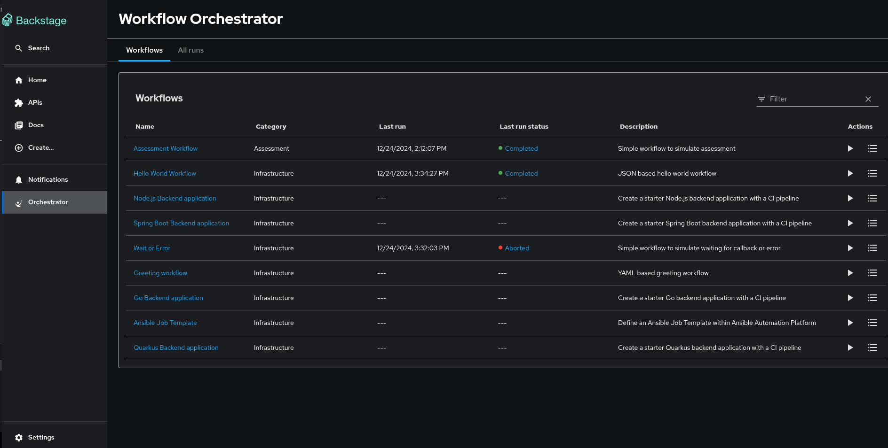

# User Interface

The Orchestrator plugin supports two primary modes of workflow interaction:

## 1. Direct Workflow Access

The user interface is accessible via the orchestrator button added in the Backstage sidebar. It provides a list of workflows and the option to run the workflows and view the results.



## 2. Template-based Workflow Integration

Workflows can also be invoked from Backstage software templates using the `orchestrator:workflow:run` action. When workflows are executed this way, a dedicated "Workflows" tab appears on the entity page, allowing users to view and manage workflow instances associated with that specific entity.

## Key Features

### Workflow Management

- Browse available workflows
- Execute workflows with custom parameters
- Monitor workflow execution status
- View workflow results and outputs

### Execute Workflow Form Prepopulation

The Execute Workflow page supports prepopulating form fields from URL query parameters. When the workflow schema defines input fields, any query parameter whose name matches a schema property path will be used to prepopulate the corresponding form field.

**Path format**

- For flat schemas, use the property name directly: `?language=English&name=John`
- For nested (multi-step) schemas, use dot notation: `?firstStep.fooTheFirst=test` or `?provideInputs.language=English`

**Schema constraints**

For fields with `enum` constraints in the schema, the query param value must match one of the allowed values. Case-insensitive matching is supported (e.g. `?language=english` maps to `English` when the enum is `['English', 'Spanish']`). Values that do not match any enum option are ignored and will not prepopulate the field.

**Reserved parameters**

The following query parameters are reserved for navigation and are not used for form prepopulation:

- `targetEntity` — Used to associate the workflow run with a catalog entity
- `instanceId` — Used when re-running or viewing a specific workflow instance

**Example**

```
/orchestrator/workflows/yamlgreet/execute?targetEntity=default:component:my-app&language=English&name=alice
```

In this example, `targetEntity` is excluded (reserved), while `language` and `name` prepopulate the form when those fields exist in the workflow schema.

### Entity Integration

- Workflow tabs on entity pages
- Entity-specific workflow instances
- Integration with Backstage catalog

### Template Integration

- Scaffold integration via custom actions
- Workflow execution from software templates
- Automated workflow triggering

## Navigation

- **Main Interface**: Access via the "Orchestrator" sidebar item
- **Entity Workflows**: Available on entity pages when workflows are associated
- **Template Workflows**: Launched from software template execution

## Permissions

The user interface respects the permission system configured for the orchestrator backend. See the [Permissions Guide](./Permissions.md) for details on access control configuration.
