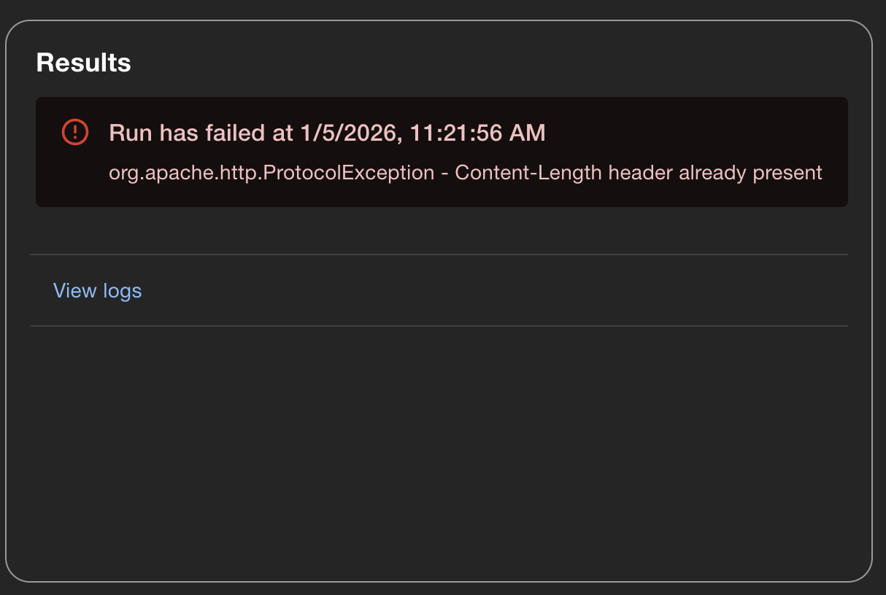
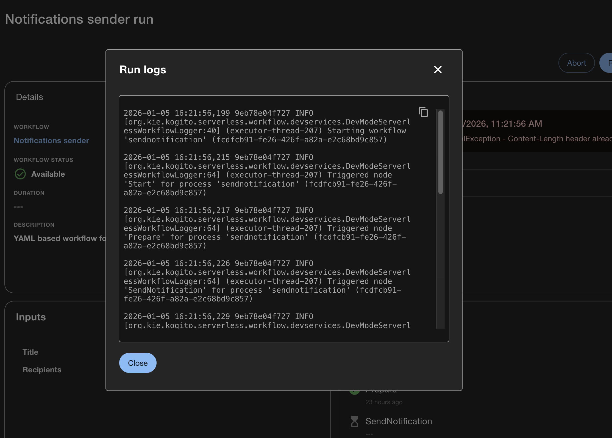

# Orchestrator Backend Module for Loki

This is an extension module to the `backstage-plugin-orchestrator-backend` plugin. It provides access to the Loki log provider

## Prerequisites

Before installing this module, ensure that the Orchestrator backend plugin is integrated into your Backstage instance. Follow the [Orchestrator README](https://github.com/redhat-developer/rhdh-plugins/tree/main/workspaces/orchestrator) for setup instructions.

This module also requires a Loki `workflowLogProvider` integration to be configured in your `app-config.yaml`. This will be added to the `orchestrator` section and might look something like this:

```
orchestrator:
  workflowLogProvider:
    loki:
      baseUrl: http://localhost:3100
      # logStreamSelectors:
      #   - label: 'app'
      #     value: '=~".+"'
```

The `baseUrl` is required.

Multiple Log Stream Selectors can be specified in the `logStreamSelectors` section. See the loki docs to learn more about log stream selectors and their values: https://grafana.com/docs/loki/latest/query/log_queries/#log-stream-selector

## Installation

To install this backend module:

```bash
# From your root directory
yarn workspace backend add @red-hat-developer-hub/backstage-plugin-orchestrator-backend-module-loki
```

```ts
// packages/backend/src/index.ts
import { createBackend } from '@backstage/backend-defaults';

const backend = createBackend();

// orchestrator
backend.add(
  import('@red-hat-developer-hub/backstage-plugin-orchestrator-backend'),
);
// orchestrator Log Provider
backend.add(
  import('@red-hat-developer-hub/backstage-plugin-orchestrator-backend-module-loki'),
);

backend.start();
```

## Usage

Once the module is successfully setup, a user can view an orchestrator workflows log. This can be accessed by the new backend endpoint here: RHDH_BACK_END_URL/api/orchestrator/v2/workflows/instances/WORKFLOW_INSTANCE_ID/logs

Or by clicking the "view log" link on the orchestrator front-end:


