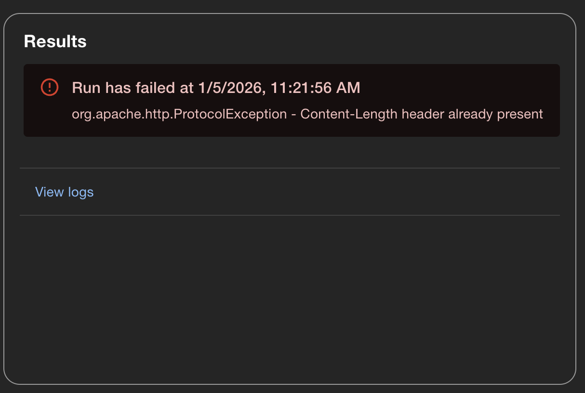
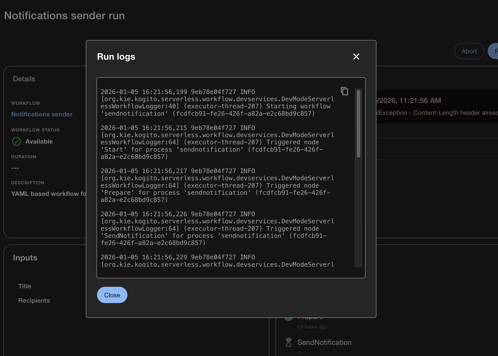

# Orchestrator Backend Module for Loki

This is an extension module to the `backstage-plugin-orchestrator-backend` plugin. It provides access to the Loki log provider

## Prerequisites

Before installing this module, ensure that the Orchestrator backend plugin is integrated into your Backstage instance. Follow the [Orchestrator README](https://github.com/redhat-developer/rhdh-plugins/tree/main/workspaces/orchestrator) for setup instructions.

This module also requires a Loki `workflowLogProvider` integration to be configured in your `app-config.yaml`. This will be added to the `orchestrator` section and might look something like this:

```yaml
orchestrator:
  workflowLogProvider:
    loki:
      # Required: absolute http(s) URL, no userinfo, query, or fragment.
      # Trailing slashes are normalized away. In production (NODE_ENV=production),
      # use https unless you set allowInsecureHttp: true (not recommended).
      baseUrl: http://localhost:3100
      # Required: bearer token for Loki (treat as a secret in real deployments).
      token: secrettoken
      # Optional: restrict baseUrl hostname (case-insensitive). Prefix with "." for
      # suffix / subdomain match, e.g. ".example.com" allows loki.prod.example.com.
      # allowedHosts:
      #   - loki.example.com
      #   - .example.com
      # Optional: allow http:// when NODE_ENV is production (default false).
      # allowInsecureHttp: false
      # Optional: max log lines per query (default 100; must not be negative).
      # limit: 100
      # Optional: set false only if baseUrl uses a cert your Node trust store does not know (e.g. self-signed). Prefer fixing CA trust in production.
      # rejectUnauthorized: false
      # Optional: extra LogQL pipeline fragments appended after the instance id filter.
      # logPipelineFilters:
      #   - '| label_format foo="bar"'
      #   - '| json'
      # Optional: stream selectors; label names must match Prometheus rules; values are validated at startup.
      # logStreamSelectors:
      #   - label: app
      #     value: '=~"myapp.+"'
```

### Configuration reference

All keys live under `orchestrator.workflowLogProvider.loki`.

| Key                  | Required | Description                                                                                                                                                                                                                                                                                                                                          |
| -------------------- | -------- | ---------------------------------------------------------------------------------------------------------------------------------------------------------------------------------------------------------------------------------------------------------------------------------------------------------------------------------------------------- |
| `baseUrl`            | yes      | Base URL of the Loki service; `/loki/api/v1/query_range` is appended. Must be a valid absolute `http:` or `https:` URL with a hostname. Must not include embedded credentials, a query string, or a fragment.                                                                                                                                        |
| `token`              | yes      | Bearer token sent to Loki (`Authorization: Bearer …`). Mark as a secret in config (see `@visibility secret` in schema).                                                                                                                                                                                                                              |
| `allowedHosts`       | no       | If set, the hostname from `baseUrl` must match one entry (case-insensitive). A leading `.` on an entry matches that domain and its subdomains (e.g. `.example.com` matches `loki.example.com`).                                                                                                                                                      |
| `allowInsecureHttp`  | no       | When `true`, allows `http:` for `baseUrl` even when `NODE_ENV` is `production`. Defaults to `false`. Outside production, `http:` is already allowed for local development.                                                                                                                                                                           |
| `limit`              | no       | Maximum number of log lines to request from Loki per query. Defaults to `100`. Must not be negative.                                                                                                                                                                                                                                                 |
| `rejectUnauthorized` | no       | TLS verification for outbound calls to Loki. Defaults to `true`. Set to `false` only if you must talk to a host with a certificate Node does not trust (e.g. self-signed); prefer proper CA configuration when possible.                                                                                                                             |
| `logPipelineFilters` | no       | Array of strings appended to the LogQL pipeline after the instance id line filter. Validated at startup.                                                                                                                                                                                                                                             |
| `logStreamSelectors` | no       | Array of `{ label?, value? }` objects. Each `label` must be a Prometheus-style name (`[a-zA-Z_][a-zA-Z0-9_]*`). Each `value` is a label matcher fragment only (e.g. `="application"` or `=~".+"`), validated at startup. If omitted or empty, defaults equivalent to OpenShift-style `openshift_log_type="application"` still apply in the provider. |

**`baseUrl` and `token` are required.** All other keys are optional.

If your `baseUrl` uses a self-signed certificate, you can set `rejectUnauthorized: false`. Use that sparingly and prefer adding the signing CA to the trust store in production.

For log stream selectors and pipeline stages, see the Loki documentation: [log stream selector](https://grafana.com/docs/loki/latest/query/log_queries/#log-stream-selector) and [log pipeline](https://grafana.com/docs/loki/latest/query/log_queries/#log-pipeline).

## Installation

To install this backend module:

```bash
# From your root directory
yarn workspace backend add @red-hat-developer-hub/backstage-plugin-orchestrator-backend-module-loki
```

```ts
// packages/backend/src/index.ts
import { createBackend } from '@backstage/backend-defaults';

const backend = createBackend();

// orchestrator
backend.add(
  import('@red-hat-developer-hub/backstage-plugin-orchestrator-backend'),
);
// orchestrator Log Provider
backend.add(
  import('@red-hat-developer-hub/backstage-plugin-orchestrator-backend-module-loki'),
);

backend.start();
```

## Usage

Once the module is successfully setup, a user can view an orchestrator workflows log. This can be accessed by the new backend endpoint here: RHDH_BACK_END_URL/api/orchestrator/v2/workflows/instances/WORKFLOW_INSTANCE_ID/logs

Or by clicking the "view log" link on the orchestrator front-end:


